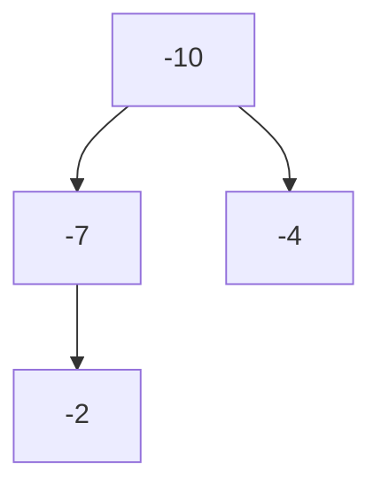

# Last Stone Weight - Problem 1046

## Problem Statement
Given a list of stone weights, repeatedly smash the two heaviest stones together. If they are equal, both are destroyed. If not, the smaller is destroyed and the difference is pushed back. Return the weight of the last remaining stone (or 0 if none).

## My Self-Reflection & Learning

### 1. My Approach and Why It Works

This problem is all about efficiently retrieving the two largest stones at each step. Since Python's `heapq` is a min-heap by default, I needed a way to simulate a max-heap.

**How I Did It:**
- I negated all the stone weights (`-stone for stone in stones`) to turn the min-heap into a max-heap.
- Now, the largest stone is always at the top (as the most negative number).
- When popping, I invert the sign again to get the original value.

**My Implementation:**
```python
import heapq

class Solution:
    def lastStoneWeight(self, stones: List[int]) -> int:
        stones = [-stone for stone in stones]  # Negate for max-heap
        heapq.heapify(stones)

        while len(stones) > 1: 
            x, y = -heapq.heappop(stones), -heapq.heappop(stones)
            if x == y : 
                continue
            else: 
                res = y-x
                heapq.heappush(stones, res)
                print(f"res: {x}-{y} = {-res}, list: {[-stone for stone in stones]}")
        
        return -stones[0] if stones else 0
```

### 2. Why This Max-Heap Trick Works
- By pushing negatives, the smallest value in the heap is actually the largest original value.
- Every time I pop, I get the largest stones efficiently in O(log n) time.
- This is a common Python trick for max-heap problems!

**Mermaid Diagram:**

- The root (-10) is actually the largest stone (10).

### 3. What I Did Well
- Used heapq efficiently for repeated max retrievals
- Understood and applied the min-heap to max-heap conversion
- Kept the code concise and readable

### 4. What I Could Improve
- Could add more comments for clarity
- Could remove debug prints for production
- Could handle edge cases (empty list) more explicitly

### 5. Key Takeaways
- Use negative values to simulate a max-heap in Python
- Heap is perfect for problems needing repeated access to largest/smallest
- Always invert the sign when pushing/popping for max-heap logic

**Memory Aid:**
> "Negate values for max-heap with heapq!"

---

[Back to Master Notes](../Notes.md)
