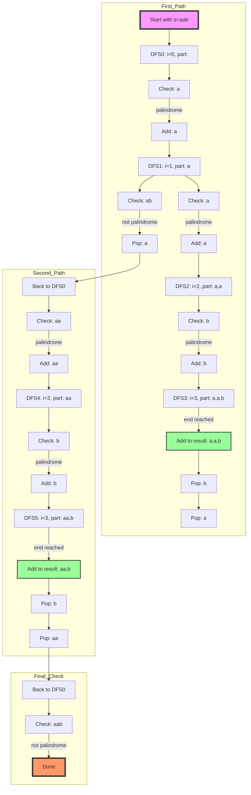

# Palindrome Partitioning (LeetCode 131) - My Learning Journey & Self-Reflection

## Problem Explanation
Given a string `s`, partition `s` such that every substring of the partition is a palindrome. Return all possible palindrome partitioning of `s`.

**Example:**
```
Input: s = "aab"
Output: [["a","a","b"],["aa","b"]]
```

## Initial Intuition and Alternative Solution

My first intuition was actually correct! I thought about splitting the string into two parts and checking each part for palindromes. I initially made it too complex, but the core idea worked when simplified:

**Alternative Implementation:**
```python
def partition(self, s: str) -> List[List[str]]:
    palindromes = []
    def backtrack(string, currList=[]):
        for index in range(0, len(string)):
            part1 = string[:index + 1]
            part2 = string[index + 1:]
            
            # Check if the first part is a palindrome
            if self.isPalindrome(part1):
                currList.append(part1)
                
                # If no second part, we have a valid partition
                if not part2:
                    palindromes.append(currList.copy())
                else:
                    # Recur for the second part
                    backtrack(part2, currList)
                
                # Backtrack by removing the last added palindrome
                currList.pop()
    
    backtrack(s)
    return palindromes
```

### Key Insights from Initial Approach:
1. My intuition to split into left and right parts was correct
2. Initially over-complicated it by trying to track too many states
3. The solution became clear when I realized:
   - Only need to check if left part is palindrome
   - If it is, append it and recursively check the right part
   - Backtrack by popping after exploring all possibilities
4. The `currList.pop()` was crucial to prevent nested list complexity

---

## My Solution

**My Implementation:**
```python
class Solution:
    def isPalindrome(self, s: str, left, right) -> bool:
        while left < right:
            while left < right and not s[left].isalnum():
                left += 1
            while left < right and not s[right].isalnum():
                right -= 1
            if s[left].lower() != s[right].lower():
                return False
            left += 1
            right -= 1
        return True

    def partition(self, s: str) -> List[List[str]]:
        res = []
        part = []
        def dfs(i):
            print(f"dfs({i}), part: {part}")  # Debugging
            if i >= len(s):
                print(f"  End reached, append: {part}")
                res.append(part.copy())
                return
            for j in range(i, len(s)):
                if self.isPalindrome(s, i, j):
                    print(f"  Palindrome found: {s[i:j+1]}")
                    part.append(s[i:j+1])
                    dfs(j+1)
                    print(f"  Backtrack, pop: {part[-1]}")
                    part.pop()
        dfs(0)
        return res
```

---

## Solution Algorithm & Debugging Walkthrough

### How the Algorithm Works
- Start DFS from index 0.
- For each index, try every possible end index `j` (from `i` to end of string).
- If `s[i:j+1]` is a palindrome, add it to the current partition (`part`), and recursively call DFS from `j+1`.
- When the end of the string is reached, add the current partition to the result.
- After recursion, backtrack by popping the last substring.

### Example Debug Walkthrough (s = "aab")

```
Call: dfs(0), part: []
  Palindrome found: a
Call: dfs(1), part: ['a']
  Palindrome found: a
Call: dfs(2), part: ['a', 'a']
  Palindrome found: b
Call: dfs(3), part: ['a', 'a', 'b']
  End reached, append: ['a', 'a', 'b']
  Backtrack, pop: b
  Backtrack, pop: a
  Palindrome found: aa
Call: dfs(2), part: ['aa']
  Palindrome found: b
Call: dfs(3), part: ['aa', 'b']
  End reached, append: ['aa', 'b']
  Backtrack, pop: b
  Backtrack, pop: aa
```

### Detailed Algorithm Walkthrough (Mermaid Diagram)


---

## Self-Reflection & Analysis

This problem taught me an important lesson about trusting initial intuitions but implementing them simply. My first thought about splitting into two parts and checking palindromes was actually correct, but I initially made it too complicated. After reviewing some resources, I realized the key was to use DFS with an index, and for each index, try every possible end index for a palindrome substring. If a palindrome is found, add it to the current partition and continue recursively. Backtracking is essential to explore all possible partitions.

**What I did:**
- Used DFS with an index to explore all possible partitions
- Checked every substring for palindrome property
- Used backtracking to build up and remove partitions as needed
- Added debug statements to understand the recursive tree and flow

**What I should watch out for in the future:**
- Trust my initial intuition but keep the implementation simple
- Don't overcomplicate state tracking - often a simple list with proper backtracking is enough
- Remember that backtracking (using pop()) is crucial for managing list state
- Consider both index-based and string-splitting approaches - both can work!
- The simplest solution is often the most elegant one
- Pay attention to list copying to avoid reference issues (use .copy())

**Personal Growth:**
- This problem improved my understanding of recursive backtracking and partitioning
- I learned to trust my intuition but also to adapt my approach when it doesn't work
- Practicing with debug output and diagrams made the algorithm much clearer

---

## Final Thoughts
- Sometimes your first intuition is right - just needs simpler implementation
- Having multiple approaches (index-based vs string-splitting) broadens problem-solving toolkit
- Backtracking with proper state management (using pop()) is key to handling combinations
- The ability to simplify complex ideas into clean code is as important as the ideas themselves
- Don't discard an approach immediately if it seems complex - try to simplify it first
