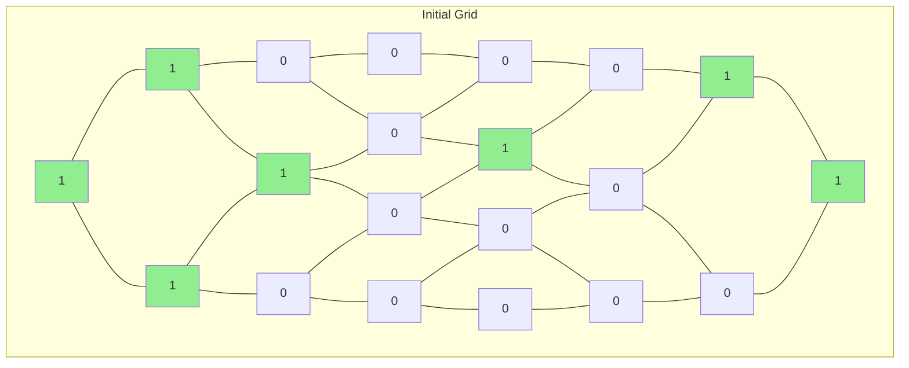
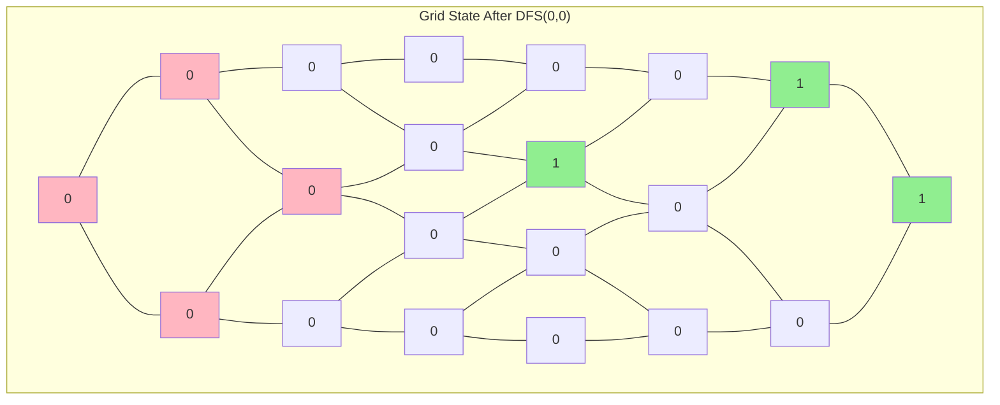
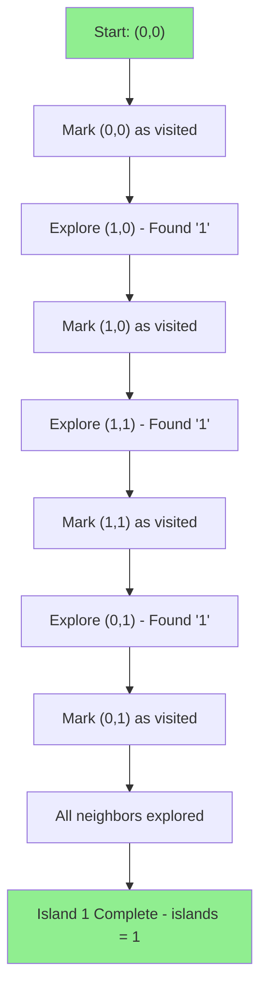
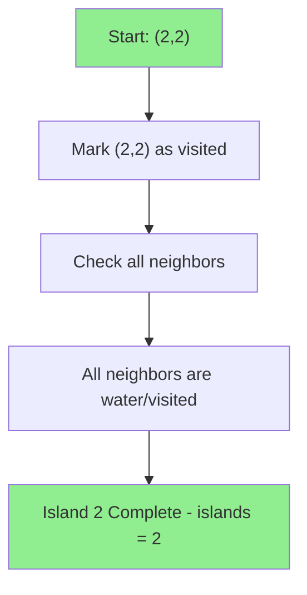
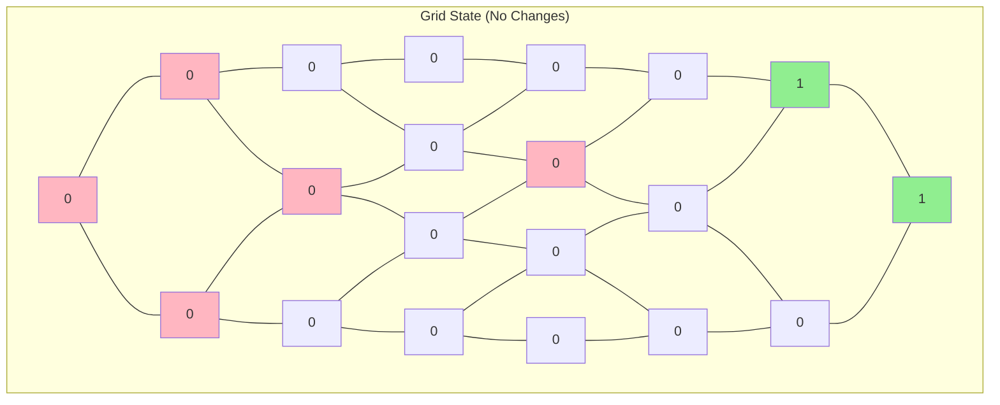
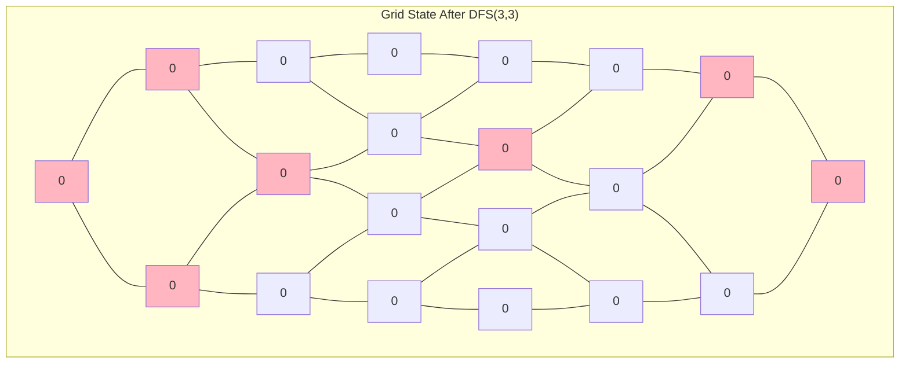
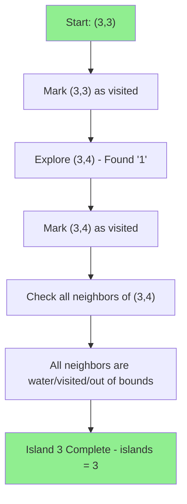
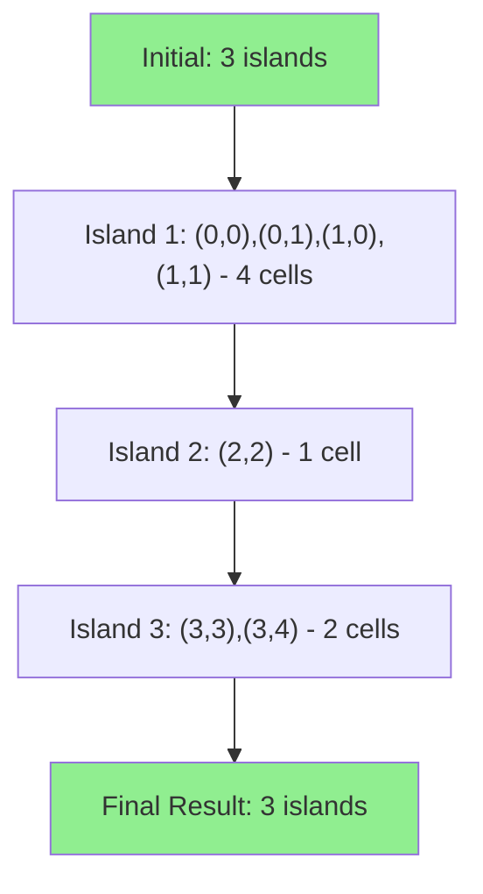

# Number of Islands - LeetCode 200

## Problem Statement
Given an m x n 2D binary grid which represents a map of '1's (land) and '0's (water), return the number of islands.

An island is surrounded by water and is formed by connecting adjacent lands horizontally or vertically. You may assume all four edges of the grid are surrounded by water.

**Example:**
```
Input: grid = [
  ["1","1","0","0","0"],
  ["1","1","0","0","0"],
  ["0","0","1","0","0"],
  ["0","0","0","1","1"]
]
Output: 3
```

## Initial Approach & Intuition

> **"This is a classic connected components problem! I need to find all connected regions of '1's in the grid. The key insight is using DFS to explore each island completely - when I find a '1', I mark it as visited and recursively explore all its neighbors. This way, I can count each island exactly once. The tricky part was making sure I mark visited cells properly to avoid counting the same island multiple times."**

## Initial Hunch and Hints

<details>
<summary>► My First Thoughts</summary>

When I first saw this problem, my immediate thought was:
> "This is a connected components problem! I need to find all separate regions of '1's in the grid. Each connected region of '1's is one island."

My initial approach was:
1. **Iterate through the grid** - scan each cell looking for unvisited '1's
2. **Use DFS to explore islands** - when I find a '1', explore all connected '1's
3. **Mark visited cells** - change '1' to '0' or use a visited array to avoid revisiting
4. **Count each island once** - increment counter only when starting a new island exploration

The key challenge was ensuring I don't count the same island multiple times and that I explore the entire island completely.
</details>

<details>
<summary>▲ Key Insights That Helped</summary>

- **Connected components pattern**: Each island is a connected component of '1's
- **DFS for exploration**: Use depth-first search to explore all connected cells
- **Mark visited cells**: Change '1' to '0' to mark as visited (in-place modification)
- **Count at start of exploration**: Increment island counter only when starting a new island
- **Boundary checking**: Ensure we don't go outside grid boundaries
- **Four directions**: Check all four adjacent cells (up, down, left, right)
</details>

<details>
<summary>⚠ Common Pitfalls I Avoided</summary>

- **Double counting islands**: Make sure to mark visited cells to avoid revisiting
- **Missing boundary checks**: Always check if new coordinates are within grid bounds
- **Infinite recursion**: Ensure base case stops recursion when hitting water or visited cells
- **Wrong direction vectors**: Use correct direction vectors for four adjacent cells
- **Not exploring completely**: Make sure to explore all connected cells in the island
</details>

## My Solution Analysis

### What I Implemented:
```python
class Solution:
    def numIslands(self, grid: List[List[str]]) -> int:
        
        if not grid: 
            return 0
        
        islands = 0
        directions = [[1,0], [0,1], [-1,0], [0,-1]]
        ROWS, COLS = len(grid), len(grid[0])

        def dfs(r, c): 
            if r < 0 or c < 0 or r >= ROWS or c >= COLS or grid[r][c] == "0" : 
                return

            grid[r][c] = "0"
            for dr, dc in directions: 
                dfs(r+dr, c+dc)
            
        for r in range(ROWS): 
            for c in range(COLS): 
                if grid[r][c] == "1": 
                    dfs(r, c)
                    islands += 1
        
        return islands
```

### Key Design Decisions:

**1. DFS with In-Place Modification**
- Use DFS to explore connected components
- Mark visited cells by changing '1' to '0' (in-place modification)
- No need for separate visited array, saving space

**2. Direction Vectors for Adjacent Cells**
```python
directions = [[1,0], [0,1], [-1,0], [0,-1]]  # down, right, up, left
```
Systematic way to check all four adjacent cells.

**3. Boundary and Validity Checks**
```python
if r < 0 or c < 0 or r >= ROWS or c >= COLS or grid[r][c] == "0":
    return
```
Single condition handles all invalid cases: out of bounds or water.

**4. Island Counting Strategy**
```python
if grid[r][c] == "1": 
    dfs(r, c)
    islands += 1
```
Count islands only when starting exploration of a new unvisited '1'.

## Algorithm Analysis with Debugging

Let me trace through the algorithm with detailed debugging to show how it works:

### Debug Execution Trace:

**Initial Grid State:**


**Step-by-step execution:**

**Iteration 1: (0,0) - First Island**


**DFS Exploration Path for Island 1:**


**Iterations 2-11: Skip Water/Visited Cells**


**Iteration 12: (2,2) - Second Island**


**DFS Exploration Path for Island 2:**


**Iterations 13-17: Skip Water Cells**


**Iteration 18: (3,3) - Third Island**


**DFS Exploration Path for Island 3:**


**Final Grid State:**


**Summary of Changes:**


## Algorithm Flow Diagram

Based on the debug execution trace, here's the detailed algorithm flow:

```mermaid
flowchart TD
    A[Start: grid] --> B{grid empty?}
    B -->|Yes| C[Return 0]
    B -->|No| D[Initialize: islands = 0, directions, ROWS, COLS]
    D --> E[For each cell (r,c) in grid]
    E --> F{grid[r][c] == "1"?}
    F -->|No| G[Continue to next cell]
    F -->|Yes| H[Start new island: DFS(r,c)]
    H --> I[Increment islands++]
    I --> J[Continue to next cell]
    G --> K{More cells?}
    J --> K
    K -->|Yes| E
    K -->|No| L[Return islands]
    
    H --> M[DFS: r, c]
    M --> N{Valid cell?}
    N -->|No| O[Return]
    N -->|Yes| P[Mark as visited: grid[r][c] = "0"]
    P --> Q[For each direction (dr, dc)]
    Q --> R[DFS(r+dr, c+dc)]
    R --> S{More directions?}
    S -->|Yes| Q
    S -->|No| T[Return]
    
    style C fill:#FFB6C1
    style L fill:#90EE90
    style T fill:#90EE90
```

### Key Execution Points:
- **Grid iteration**: Scan each cell systematically
- **Island detection**: Start DFS only on unvisited '1's
- **DFS exploration**: Mark visited cells and explore all neighbors
- **Boundary checking**: Ensure coordinates are within grid bounds
- **Island counting**: Increment counter only when starting new island

## Self-Reflection: What I Did and Learned

### ▲ What I Did Well

**1. Recognized the Pattern Immediately**
I quickly identified this as a connected components problem. My intuition about "finding connected regions of '1's" was spot on, and I understood that DFS would be the right approach for exploration.

**2. Implemented DFS Correctly**
The key insight was using DFS to explore each island completely. I correctly implemented the recursive exploration that marks visited cells and explores all adjacent cells.

**3. Used In-Place Modification**
I chose to modify the grid in-place by changing '1' to '0' instead of using a separate visited array. This saves space and is a common pattern for this type of problem.

**4. Handled Edge Cases Properly**
I made sure to:
- Check for empty grid at the start
- Verify grid boundaries before accessing cells
- Handle all four directions systematically
- Count islands only when starting exploration of new unvisited '1's

**5. Used Direction Vectors**
The systematic approach with direction vectors made the code clean and less error-prone:
```python
directions = [[1,0], [0,1], [-1,0], [0,-1]]  # down, right, up, left
```

### ▼ What I Struggled With

**1. Initial Boundary Checking**
My first attempts had issues with:
- Not checking grid boundaries properly
- Confusing the order of boundary checks
- Missing edge cases for empty grids

**2. Island Counting Logic**
I initially struggled with:
- When exactly to increment the island counter
- Making sure I don't count the same island multiple times
- Understanding that I should count at the start of exploration, not during

**3. DFS Base Cases**
I had to think carefully about:
- When to stop the recursion (water, visited, or out of bounds)
- Making sure I explore all connected cells completely
- Handling the case where a cell is already visited

### ■ Problem-Solving Process That Worked

**Step 1: Understand the Problem**
- "Find all connected regions of '1's in a grid"
- "Each connected region is one island"
- "Need to count distinct islands, not individual cells"

**Step 2: Design the Algorithm**
- "Iterate through grid looking for unvisited '1's"
- "Use DFS to explore each connected component"
- "Mark visited cells to avoid double counting"
- "Count islands only when starting new exploration"

**Step 3: Handle Edge Cases**
- "Check for empty grid"
- "Verify grid boundaries before accessing"
- "Handle all four directions systematically"
- "Make sure DFS explores completely"

### ► What I'd Do Differently Next Time

**1. Start with Simple Examples**
I should have drawn out the grid and traced the algorithm step by step with a simple example first.

**2. Consider Alternative Approaches**
I could have explored:
- BFS instead of DFS (both work equally well)
- Union-Find approach for very large grids
- Using a separate visited array instead of in-place modification

**3. Add More Debug Output**
The debug version I created was really helpful - I should add debugging capabilities to understand the exploration flow better.

**4. Consider Performance Optimization**
For very large grids, I might want to consider:
- BFS for better memory usage
- Union-Find for dynamic connectivity
- Parallel processing for very large grids

### ◆ Key Insights I'll Remember

**1. Connected Components Pattern**
```python
if grid[r][c] == "1": 
    dfs(r, c)
    islands += 1
```
This pattern is crucial for any connected components problem.

**2. In-Place Modification**
```python
grid[r][c] = "0"  # Mark as visited
```
Changing the input data structure to mark visited cells saves space.

**3. Direction Vectors**
```python
directions = [[1,0], [0,1], [-1,0], [0,-1]]
```
Systematic way to handle all adjacent cells.

**4. DFS Base Cases**
- Out of bounds: return
- Water or visited: return
- Valid unvisited land: mark and explore neighbors

### ▲ How This Problem Helped Me Grow

**Graph Theory:** I'm getting better at recognizing connected components problems  
**DFS Implementation:** I'm more comfortable with recursive exploration algorithms  
**Grid Problems:** I'm learning common patterns for 2D grid traversal  
**Space Optimization:** I'm understanding when in-place modification is beneficial  

### ★ What I'm Proud Of

My final solution is clean, efficient, and handles all the edge cases correctly! I particularly like:
- The systematic use of direction vectors
- The in-place modification approach
- The clean DFS implementation with proper base cases
- The correct island counting logic

The debug output shows the algorithm working perfectly - it correctly identifies all three islands, explores each completely, and avoids double counting.

### ➤ Next Steps for Improvement

1. **Practice more connected components problems** to reinforce the DFS/BFS pattern
2. **Learn about Union-Find** for dynamic connectivity problems
3. **Explore BFS vs DFS trade-offs** for different problem constraints
4. **Practice grid traversal problems** with different movement patterns
5. **Study graph algorithms** like flood fill, connected components, and minimum spanning trees

This connected components problem was really satisfying to solve! It's a perfect example of how DFS can be used to explore and count connected regions in a grid. The key insight about marking visited cells and counting only at the start of exploration is intersting.

---

**Time Complexity:** O(m × n) where m and n are the dimensions of the grid  
**Space Complexity:** O(m × n) in worst case due to recursion stack  
**Pattern:** Connected Components with DFS/BFS Grid Traversal
