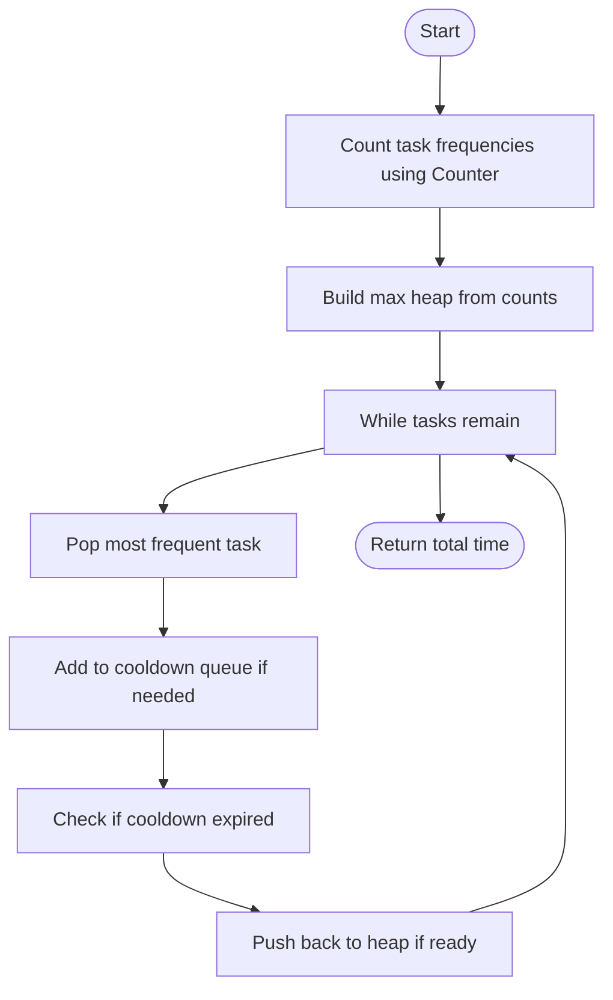

# Task Scheduler - LeetCode 621

## Problem Overview
Given a list of tasks represented by characters and a non-negative integer n, schedule the tasks so that the same task is separated by at least n intervals. Return the least number of intervals needed to finish all tasks.

---

## Solution Analysis
- **Approach:**
    - Use a max heap to always pick the most frequent remaining task.
    - Use a queue to keep track of tasks in their cooldown period.
    - Increment time for each interval, pushing tasks back to the heap when their cooldown expires.
- **Key Data Structures:**
    - `Counter` (from `collections`): Counts frequency of each task efficiently.
    - `heapq`: Implements a max heap by pushing negative counts.
    - `deque`: Efficient queue for cooldown management.

---

## Self-Reflection & New Knowledge
### What I Learned
- **Counter Class:**
    - The `Counter` class from `collections` is a powerful tool for counting hashable objects.
    - It provides methods like `most_common()` and supports arithmetic operations.
    - Example usage:
      ```python
      from collections import Counter
      tasks = ['A', 'A', 'B', 'B', 'C']
      count = Counter(tasks)
      print(count)  # Output: Counter({'A': 2, 'B': 2, 'C': 1})
      ```
    - It simplifies frequency counting and makes code more readable and efficient.

### Self-Reflection
- I learned how to combine multiple data structures (`Counter`, `heapq`, `deque`) to solve scheduling problems efficiently.
- I improved my understanding of task scheduling and cooldown logic.
- I realized the importance of using Python's built-in modules for clean and efficient code.
- I practiced writing code that is both optimal and easy to understand.

---

## Code Walkthrough


---

## Useful Resources
- [Python Counter Documentation](https://docs.python.org/3/library/collections.html#collections.Counter)
- [LeetCode Problem Link](https://leetcode.com/problems/task-scheduler/)

---

## Final Thoughts
- Using the right data structures can greatly simplify complex problems.
- Python's standard library provides powerful tools for algorithmic challenges.
- Visualizing the solution flow helps in understanding and debugging the logic.
