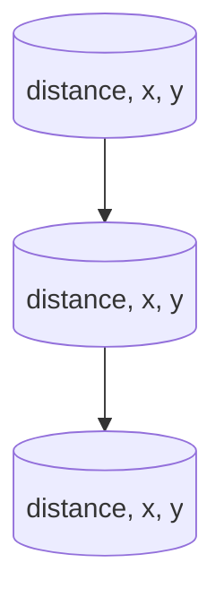

# K Closest Points to Origin - Problem 973

## Problem Statement
Given an array of points on the X-Y plane and an integer k, return the k closest points to the origin (0, 0).

## My Self-Reflection & Learning

### 1. My Approach and Why It Works

This problem is about efficiently finding the k points with the smallest Euclidean distance to the origin. I used a min-heap to always extract the closest points.

**How I Did It:**
- For each point, I calculated the squared distance to the origin (no need for sqrt).
- I inserted the distance at the **start** of each point list, so the heap would compare by distance.
- I used `heapq.heapify(points)` to turn the list into a heap in-place.
- I popped k times to get the k closest points.

**My Implementation:**
```python
import heapq

class Solution:
    def kClosest(self, points: List[List[int]], k: int) -> List[List[int]]:
        for point in points : 
            res = (point[0])**2 + (point[1])**2
            point.insert(0, res)  # Insert distance at the start
        
        heapq.heapify(points)
        dist = []
        while k > 0: 
            res, x, y = heapq.heappop(points)
            dist.append([x, y])
            k -= 1
        return dist
```

### 2. Key Realization: Heapify and List Order 
- When using `heapq` on a list of lists, the heap compares the elements based on a priority of each sublist.
- **Mistake:** I originally used `append` to add the distance at the end, but then the heap compared the list based on priority for x y and distance!
- **Fix:** By using `insert(0, res)`, the distance is the first element, so the heap works as intended.
- This bug showed up on the test case `[[1,3],[-2,2],[2,-2]], k=2` because the heap was not comparing by distance.

**Mermaid Diagram:**

- The heap always compares by the first value (distance).

### 3. What I Did Well
- Used heapq efficiently for repeated min retrievals
- Realized the importance of element order in list of lists
- Kept the code concise and readable

### 4. What I Could Improve
- Add comments for clarity
- Consider using tuples for immutability
- Could use a max-heap for large k (if k << n)

### 5. Key Takeaways
- When heapifying a list of lists, the first element is the comparison key
- Always check what the heap is actually comparing!
- Use squared distance to avoid unnecessary computation

**Memory Aid:**
> "For heapq on list of lists, put the key at index 0!"

---

[Back to Master Notes](../Notes.md)
