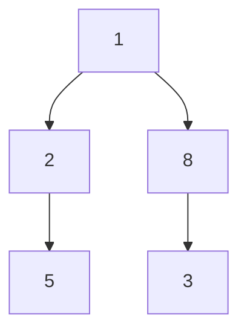
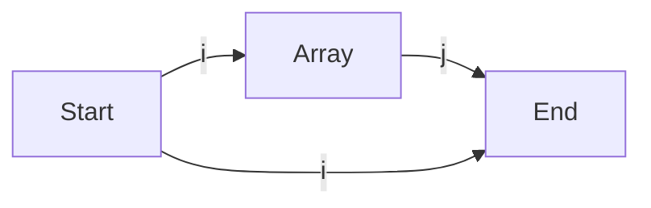
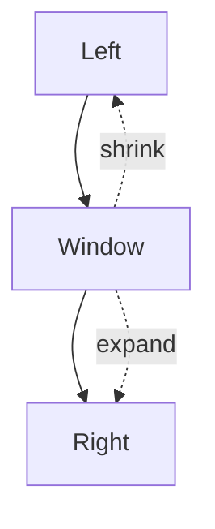
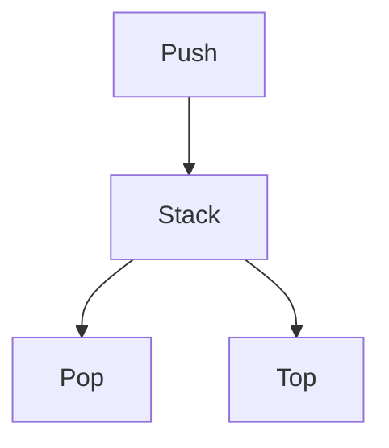
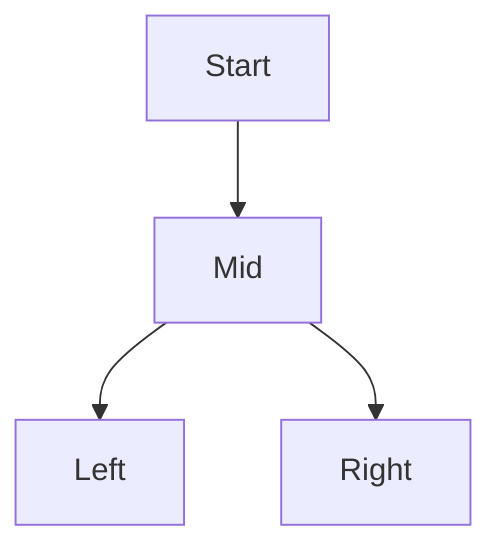
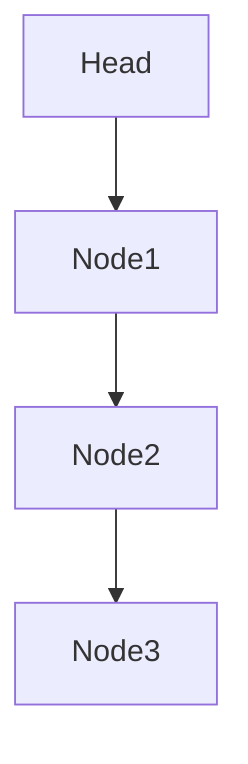
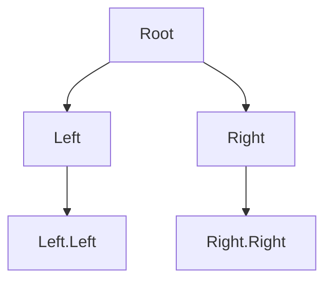
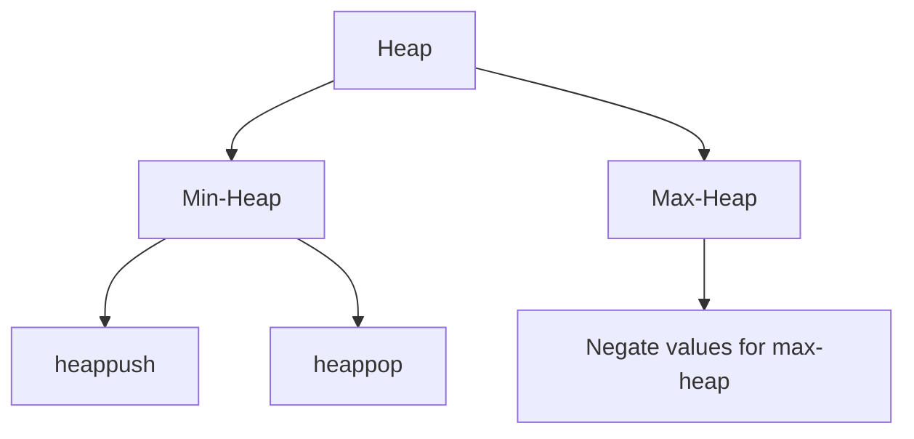

# Python `heapq` Library - Comprehensive Notes

## Overview
`heapq` is Python's built-in library for implementing heaps (priority queues). It provides an efficient way to maintain a heap data structure using a regular Python list. By default, `heapq` implements a **min-heap** (the smallest element is always at the root).

---

## Core Methods and Their Usage

### 1. `heapq.heapify(x)`
- Transforms a list `x` into a heap, in-place, in O(n) time.
- After calling, `x[0]` is the smallest element.

```python
import heapq
nums = [5, 2, 8, 1]
heapq.heapify(nums)  # nums is now a valid min-heap: [1, 2, 8, 5]
```

### 2. `heapq.heappush(heap, item)`
- Pushes `item` onto the heap, maintaining the heap invariant.
- O(log n) time.

```python
heapq.heappush(nums, 3)  # nums becomes [1, 2, 8, 5, 3] (heap order)
```

### 3. `heapq.heappop(heap)`
- Pops and returns the smallest item from the heap.
- O(log n) time.

```python
smallest = heapq.heappop(nums)  # removes 1, nums is now [2, 3, 8, 5]
```

### 4. `heapq.heappushpop(heap, item)`
- Pushes `item` on the heap, then pops and returns the smallest item.
- More efficient than `heappush` followed by `heappop`.

```python
result = heapq.heappushpop(nums, 4)  # pushes 4, pops 2, returns 2
```

### 5. `heapq.heapreplace(heap, item)`
- Pops and returns the smallest item, then pushes `item` onto the heap.
- The heap size does not change.
- More efficient than `heappop` followed by `heappush`.

```python
result = heapq.heapreplace(nums, 7)  # pops 3, pushes 7
```

### 6. `heapq.nlargest(n, iterable[, key=None])`
- Returns a list with the `n` largest elements from the dataset.
- Useful for quick top-k queries.

```python
top3 = heapq.nlargest(3, nums)  # returns 3 largest elements
```

### 7. `heapq.nsmallest(n, iterable[, key=None])`
- Returns a list with the `n` smallest elements from the dataset.

```python
smallest2 = heapq.nsmallest(2, nums)  # returns 2 smallest elements
```

---

## How a Min-Heap Works (Mermaid Diagram)


- The smallest element (1) is always at the root.
- Each parent node is less than or equal to its children.

---

## Max-Heap with `heapq`
- Python's `heapq` only provides a min-heap.
- To simulate a max-heap, **push negative values** and invert when popping.

```python
maxheap = []
heapq.heappush(maxheap, -val)  # push negatives
maxval = -heapq.heappop(maxheap)  # pop and invert
```

---

## Practical Tips
- Heaps are great for efficiently finding the smallest/largest elements in O(log n) time.
- For fixed-size top-k problems, always keep the heap at size k for best performance.
- `heapq` works in-place on lists; always use a list as the heap container.

---

## Summary Table
| Method                | Description                                 |
|-----------------------|---------------------------------------------|
| heapify(x)            | In-place transform list into heap           |
| heappush(heap, item)  | Push item onto heap                         |
| heappop(heap)         | Pop and return smallest item                |
| heappushpop(heap, x)  | Push then pop smallest (more efficient)     |
| heapreplace(heap, x)  | Pop smallest, then push x                   |
| nlargest(n, iter)     | Return n largest elements                   |
| nsmallest(n, iter)    | Return n smallest elements                  |

---

## References
- [Python heapq documentation](https://docs.python.org/3/library/heapq.html)
- [Real Python: Heap queue (priority queue) algorithm](https://realpython.com/python-heaps/)

---

# LeetCode Master Notes & Topic Map

Welcome! This document is a master index and concept guide for your LeetCode solutions, organized by major algorithmic topics. Each section includes a high-level explanation, a mermaid diagram for intuition, and links to your detailed notes and solutions for each problem.

---

## Arrays & Hashing

**Concept:** Arrays are the foundation of most coding problems. Hashing (using dictionaries/sets) allows for fast lookups and deduplication.

**Main Code Idea:** Use arrays for sequential data, and hash tables for O(1) lookups, frequency counting, and deduplication.

```mermaid
graph TD
    A[Array] --> B[Hash Table]
    B --> C[O(1) Lookup]
    A --> D[Two Pointers]
    A --> E[Sliding Window]
```

**Problems:**
- [1. Two Sum](./1/README.md)
- [121. Best Time to Buy and Sell Stock](./121/README.md)
- [128. Longest Consecutive Sequence](./128/README.md)
- [238. Product of Array Except Self](./238/README.md)
- [242. Valid Anagram](./242/README.md)
- [49. Group Anagrams](./49/README.md)
- [347. Top K Frequent Elements](./347/README.md)

---

## Two Pointers

**Concept:** Use two indices to scan through data, often from both ends or to maintain a window.

**Main Code Idea:** Move pointers inward/outward to find pairs, reverse arrays, or partition data.



**Problems:**
- [15. 3Sum](./15/README.md)
- [167. Two Sum II - Input Array Is Sorted](./167/README.md)
- [19. Remove Nth Node From End of List](./19/README.md)
- [26. Remove Duplicates from Sorted Array](#) *(add if available)*
- [125. Valid Palindrome](./125/README.md)

---

## Sliding Window

**Concept:** Maintain a window over a subset of data to solve substring/subarray problems efficiently.

**Main Code Idea:** Expand and contract the window to maintain a property (e.g., unique elements, sum, etc.).



**Problems:**
- [3. Longest Substring Without Repeating Characters](./3/README.md)
- [121. Best Time to Buy and Sell Stock](./121/README.md)
- [567. Permutation in String](./567/README.md)
- [424. Longest Repeating Character Replacement](./424/README.md)

---

## Stack

**Concept:** LIFO structure for parsing, backtracking, and expression evaluation.

**Main Code Idea:** Use a stack to match parentheses, evaluate expressions, or track state.



**Problems:**
- [20. Valid Parentheses](./20/README.md)
- [155. Min Stack](./155/README.md)
- [150. Evaluate Reverse Polish Notation](./150/README.md)
- [739. Daily Temperatures](./739/README.md)

---

## Binary Search

**Concept:** Efficiently search sorted data by halving the search space each step.

**Main Code Idea:** Use left/right pointers and mid calculation to find targets or boundaries.



**Problems:**
- [33. Search in Rotated Sorted Array](./33/README.md)
- [704. Binary Search](./704/README.md)
- [153. Find Minimum in Rotated Sorted Array](./153/README.md)
- [74. Search 2D Matrix](./74/README.md)
- [875. Koko Eating Bananas](./875/README.md)

---

## Linked List

**Concept:** Sequential data structure with nodes pointing to the next (and sometimes previous) node.

**Main Code Idea:** Use pointers to traverse, reverse, or manipulate nodes.



**Problems:**
- [2. Add Two Numbers](./2/README.md)
- [21. Merge Two Sorted Lists](./21/README.md)
- [206. Reverse Linked List](./206/README.md)
- [141. Linked List Cycle](./141/README.md)
- [143. Reorder List](./143/README.md)
- [19. Remove Nth Node From End of List](./19/README.md)

---

## Trees

**Concept:** Hierarchical data structure with parent-child relationships.

**Main Code Idea:** Use recursion or BFS/DFS to traverse, search, or modify trees.



**Problems:**
- [104. Maximum Depth of Binary Tree](./104/README.md)
- [226. Invert Binary Tree](./226/README.md)
- [543. Diameter of Binary Tree](./543/README.md)
- [572. Subtree of Another Tree](./572/README.md)
- [1448. Count Good Nodes in Binary Tree](./1448/README.md)
- [230. Kth Smallest Element in a BST](./230/README.md)
- [235. Lowest Common Ancestor of a BST](./235/README.md)
- [98. Validate Binary Search Tree](./98/README.md)

---

## Heap / Priority Queue

**Concept:** Specialized tree-based structure for efficiently retrieving the min/max element.

**Main Code Idea:** Use a heap to maintain a dynamic set of elements, always able to access the smallest/largest in O(log n) time.



**Problems:**
- [703. Kth Largest Element in a Stream](./703/README.md)
- [347. Top K Frequent Elements](./347/README.md)
- [1046. Last Stone Weight](./1046/README.md)
- [Notes on heapq library](./Notes.md)

---

## More Topics
- [36. Valid Sudoku](./36/README.md)
- [42. Trapping Rain Water](./42/README.md)
- [49. Group Anagrams](./49/README.md)
- [22. Generate Parentheses](./22/README.md)

---

**How to Use This Guide:**
- Click any problem link for your detailed notes and code.
- Use the mermaid diagrams to visualize the core idea of each topic.
- Add new problems and notes as you solve more!

---

*Happy coding and keep building your algorithmic intuition!*
