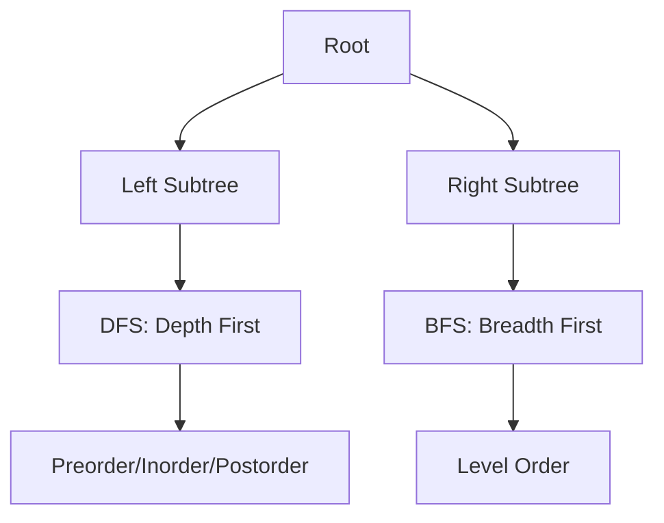
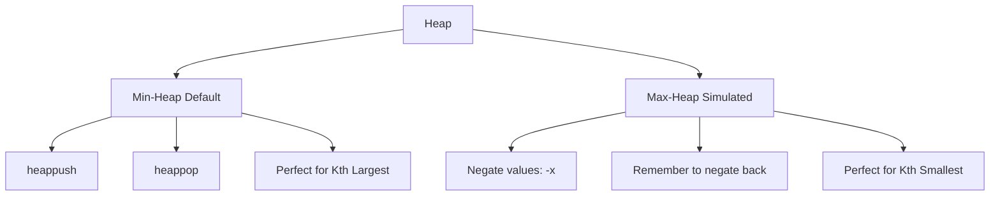
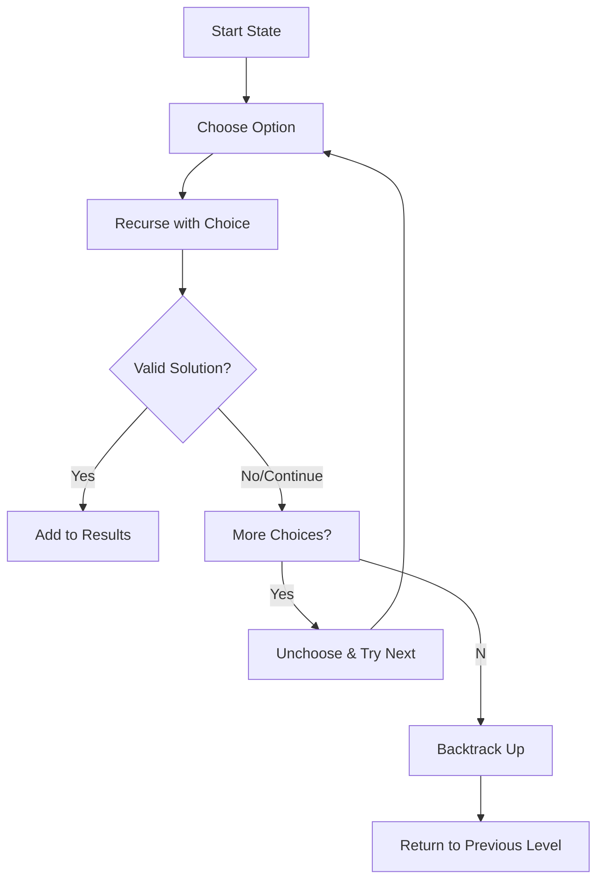
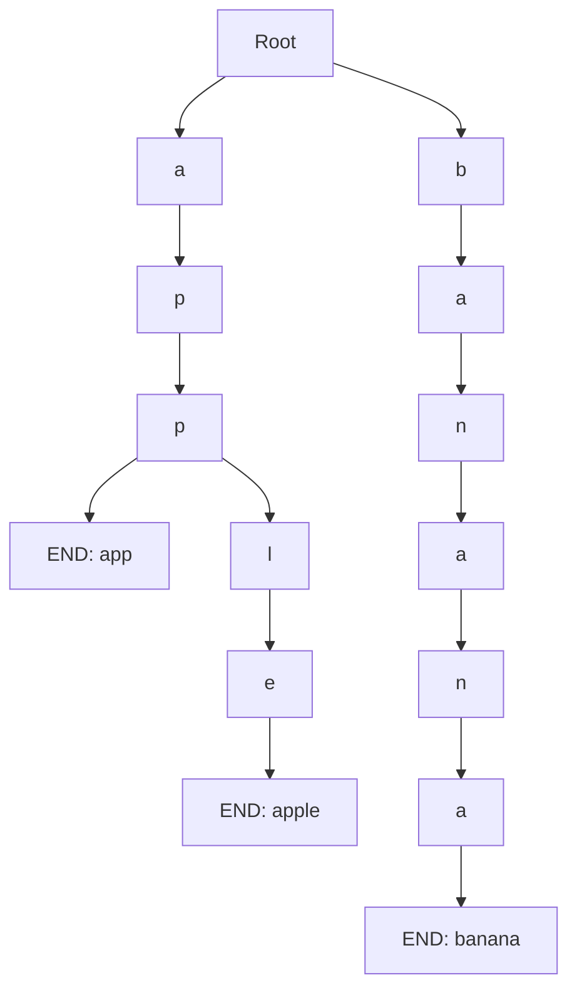

# LeetCode Master Notes & Topic Map

Welcome! This document is a master index and concept guide for your LeetCode solutions, organized by major algorithmic topics. Each section includes a high-level explanation, a mermaid diagram for intuition, and links to your detailed notes and solutions for each problem.

---

## Arrays & Hashing
<details>
<summary>Click to expand Arrays & Hashing concepts and problems</summary>

### Concept Overview
Arrays are the foundation of most coding problems. Hashing (using dictionaries/sets) allows for fast lookups and deduplication.

### [📘 Detailed Notes](./notes/Notes_Arrays_and_Hashing.md)

### Main Code Idea
Use arrays for sequential data, and hash tables for O(1) lookups, frequency counting, and deduplication.

<details>
<summary>Visual Pattern</summary>

```mermaid
graph TD
    A[Array] --> B[Hash Table]
    B --> C[O(1) Lookup]
    A --> D[Two Pointers]
    A --> E[Sliding Window]
```
</details>

### Common Patterns
- Frequency counting with hash maps
- Two-pass hash table technique
- Set operations for deduplication
- In-place array modifications

### Problems by Difficulty
<details>
<summary>Easy</summary>

- [1. Two Sum](./1/README.md)
- [242. Valid Anagram](./242/README.md)
</details>

<details>
<summary>Medium</summary>

- [49. Group Anagrams](./49/README.md)
- [238. Product of Array Except Self](./238/README.md)
- [347. Top K Frequent Elements](./347/README.md)
</details>

<details>
<summary>Hard</summary>

- [128. Longest Consecutive Sequence](./128/README.md)
</details>

### Quick Tips
- Always consider using a hash table for O(1) lookups
- Use sets for quick membership testing
- Consider space-time tradeoffs
</details>

---

## Two Pointers
<details>
<summary>Click to expand Two Pointers concepts and problems</summary>

### Concept Overview
Use two indices to scan through data, often from both ends or to maintain a window.

### [📘 Detailed Notes](./notes/Notes_Two_Pointers.md)

### Main Code Idea
Move pointers inward/outward to find pairs, reverse arrays, or partition data.

<details>
<summary>Visual Pattern</summary>


</details>

### Common Patterns
- Opposite direction pointers
- Fast & slow pointers
- Multiple array traversal
- Sliding window initialization

### Problems by Difficulty
<details>
<summary>Easy</summary>

- [125. Valid Palindrome](./125/README.md)
- [167. Two Sum II - Input Array Is Sorted](./167/README.md)
</details>

<details>
<summary>Medium</summary>

- [15. 3Sum](./15/README.md)
- [19. Remove Nth Node From End of List](./19/README.md)
</details>

<details>
<summary>Coming Soon</summary>

- [26. Remove Duplicates from Sorted Array](#) *(add if available)*
</details>

### Quick Tips
- Consider both directions (inward/outward)
- Watch for off-by-one errors
- Handle edge cases carefully
</details>

---

## Sliding Window
<details>
<summary>Click to expand Sliding Window concepts and problems</summary>

### Concept Overview
Maintain a window over a subset of data to solve substring/subarray problems efficiently.

### [📘 Detailed Notes](./notes/Notes_Sliding_Window.md)

### Main Code Idea
Expand and contract the window to maintain a property (e.g., unique elements, sum, etc.).

<details>
<summary>Visual Pattern</summary>


</details>

### Common Patterns
- Fixed size window
- Variable size window
- Character frequency counting
- Dynamic window conditions

### Problems by Difficulty
<details>
<summary>Easy</summary>

- [121. Best Time to Buy and Sell Stock](./121/README.md)
</details>

<details>
<summary>Medium</summary>

- [3. Longest Substring Without Repeating Characters](./3/README.md)
- [424. Longest Repeating Character Replacement](./424/README.md)
- [567. Permutation in String](./567/README.md)
</details>

### Quick Tips
- Track window state efficiently (hash map/set)
- Know when to expand vs contract
- Consider both fixed and variable windows
</details>

---

## Stack
<details>
<summary>Click to expand Stack concepts and problems</summary>

### Concept Overview
LIFO (Last In, First Out) structure for parsing, backtracking, and expression evaluation.

### [📘 Detailed Notes](./notes/Notes_Stack.md)

### Main Code Idea
Use a stack to match parentheses, evaluate expressions, or track state.

<details>
<summary>Visual Pattern</summary>


</details>

### Common Patterns
- Parentheses matching
- Expression evaluation
- Monotonic stack
- Min/max tracking
- History tracking

### Problems by Difficulty
<details>
<summary>Easy</summary>

- [20. Valid Parentheses](./20/README.md)
- [155. Min Stack](./155/README.md)
</details>

<details>
<summary>Medium</summary>

- [150. Evaluate Reverse Polish Notation](./150/README.md)
- [739. Daily Temperatures](./739/README.md)
</details>

### Quick Tips
- Always check for empty stack before popping
- Consider using auxiliary stacks for min/max
- Watch for nested structure patterns
- Remember LIFO property for history tracking
</details>

---

## Binary Search
<details>
<summary>Click to expand Binary Search concepts and problems</summary>

### Concept Overview
Efficiently search sorted data by halving the search space each step.

### [📘 Detailed Notes](./notes/Notes_Binary_Search.md)

### Main Code Idea
Use left/right pointers and mid calculation to find targets or boundaries.

<details>
<summary>Visual Pattern</summary>


</details>

### Common Patterns
- Classic binary search
- Left/right boundary search
- Rotated array search
- Matrix binary search
- Search on answer space

### Problems by Difficulty
<details>
<summary>Easy</summary>

- [704. Binary Search](./704/README.md)
</details>

<details>
<summary>Medium</summary>

- [33. Search in Rotated Sorted Array](./33/README.md)
- [74. Search 2D Matrix](./74/README.md)
- [875. Koko Eating Bananas](./875/README.md)
</details>

<details>
<summary>Hard</summary>

- [153. Find Minimum in Rotated Sorted Array](./153/README.md)
</details>

### Quick Tips
- Always handle integer overflow with `mid = left + (right - left) // 2`
- Consider both inclusive `[left, right]` and exclusive `[left, right)` ranges
- Watch for infinite loops in while conditions
- Remember binary search can be used on answer spaces too
</details>

---

## Linked List
<details>
<summary>Click to expand Linked List concepts and problems</summary>

### Concept Overview
Sequential data structure with nodes pointing to the next (and sometimes previous) node.

### [📘 Detailed Notes](./notes/Notes_Linked_Lists.md)

### Main Code Idea
Use pointers to traverse, reverse, or manipulate nodes.

<details>
<summary>Visual Pattern</summary>


</details>

### Common Patterns
- Dummy node technique
- Fast & slow pointers
- Multiple pointer manipulation
- Recursion vs iteration

### Problems by Difficulty
<details>
<summary>Easy</summary>

- [21. Merge Two Sorted Lists](./21/README.md)
- [141. Linked List Cycle](./141/README.md)
- [206. Reverse Linked List](./206/README.md)
</details>

<details>
<summary>Medium</summary>

- [2. Add Two Numbers](./2/README.md)
- [19. Remove Nth Node From End of List](./19/README.md)
- [143. Reorder List](./143/README.md)
</details>

<details>
<summary>Hard</summary>

- [146. LRU Cache](./146/README.md)
</details>

### Quick Tips
- Use dummy nodes for cleaner head manipulation
- Save next pointers before modifying links
- Consider both iterative and recursive approaches
</details>

---

## Trees
<details>
<summary>Click to expand Trees concepts and problems</summary>

### Concept Overview
Hierarchical data structures with parent-child relationships, perfect for representing nested or hierarchical data.

### [📘 Detailed Notes](./notes/Notes_Trees.md)

### Main Code Idea
Use recursion or BFS/DFS to traverse, search, or modify trees. Master the recursive patterns for most tree problems.

<details>
<summary>Visual Pattern</summary>


</details>

### Common Patterns
- Recursive tree traversal (DFS)
- Level-order traversal (BFS)
- Path tracking and state passing
- BST property utilization
- Bottom-up vs top-down recursion

### Problems by Difficulty
<details>
<summary>Easy</summary>

- [100. Same Tree](./100/README.md)
- [104. Maximum Depth of Binary Tree](./104/README.md)
- [110. Balanced Binary Tree](./110/README.md)
- [226. Invert Binary Tree](./226/README.md)
- [235. Lowest Common Ancestor of a BST](./235/README.md)
</details>

<details>
<summary>Medium</summary>

- [98. Validate Binary Search Tree](./98/README.md)
- [102. Binary Tree Level Order Traversal](./102/README.md)
- [230. Kth Smallest Element in a BST](./230/README.md)
- [543. Diameter of Binary Tree](./543/README.md)
- [572. Subtree of Another Tree](./572/README.md)
- [1448. Count Good Nodes in Binary Tree](./1448/README.md)
</details>

### Quick Tips
- Most tree problems use recursion naturally
- Consider both DFS and BFS approaches
- Pass state through recursion parameters
- Use BST properties for efficient searches
- Watch for null node edge cases
</details>

---

## Heap / Priority Queue
<details>
<summary>Click to expand Heap / Priority Queue concepts and problems</summary>

### Concept Overview
Specialized tree-based structure for efficiently retrieving the min/max element, perfect for top-k problems and priority-based processing.

### [📘 Detailed Notes](./notes/Notes_Heap.md)

### Main Code Idea
Use a heap to maintain dynamic access to extremes (min/max). Master the top-k pattern and max-heap simulation.

<details>
<summary>Visual Pattern</summary>


</details>

### Common Patterns
- Top-k element problems
- Streaming data processing
- Priority queue operations
- Max-heap simulation with negation
- Merge k sorted structures

### Problems by Difficulty
<details>
<summary>Easy</summary>

- [703. Kth Largest Element in a Stream](./703/README.md)
- [1046. Last Stone Weight](./1046/README.md)
</details>

<details>
<summary>Medium</summary>

- [215. Kth Largest Element in an Array](./215/README.md)
- [347. Top K Frequent Elements](./347/README.md)
- [621. Task Scheduler](./621/README.md)
- [973. K Closest Points to Origin](./973/README.md)
</details>

### Quick Tips
- Python heapq is min-heap only - negate for max-heap
- Use heap for top-k problems efficiently
- Keep heap size at k for optimal space
- Remember heap[0] gives minimum (don't pop if just peeking)
- Use heapify() for bulk initialization
</details>

---

## Backtracking
<details>
<summary>Click to expand Backtracking concepts and problems</summary>

### Concept Overview
Systematically search for solutions by exploring all possibilities and backtracking when paths fail. Essential for combinatorial and constraint satisfaction problems.

### [📘 Detailed Notes](./notes/Notes_Backtracking.md)

### Main Code Idea
Build solutions incrementally using the choose-explore-unchoose pattern. Master the recursive template for combinations and permutations.

<details>
<summary>Visual Pattern</summary>


</details>

### Common Patterns
- Choose-Explore-Unchoose template
- Constraint checking and early pruning
- Duplicate handling with sorting
- Path copying for result collection
- State restoration after recursion

### Problems by Difficulty
<details>
<summary>Easy</summary>

- [17. Letter Combinations of a Phone Number](./17/README.md)
- [22. Generate Parentheses](./22/README.md)
</details>

<details>
<summary>Medium</summary>

- [39. Combination Sum](./39/README.md)
- [40. Combination Sum II](./40/README.md)
- [46. Permutations](./46/README.md)
- [78. Subsets](./78/README.md)
- [90. Subsets II](./90/README.md)
- [131. Palindrome Partitioning](./131/README.md)
- [79. Word Search](./79/README.md)
</details>

### Quick Tips
- Always copy the path when adding to results: `result.append(path.copy())`
- Sort input arrays to handle duplicates easier
- Use start index for combinations, boolean array for permutations
- Implement early pruning to optimize performance
- Remember the backtrack step: `path.pop()`
</details>

---

## Trie (Prefix Tree)
<details>
<summary>Click to expand Trie concepts and problems</summary>

### Concept Overview
Tree-like data structure for storing and retrieving strings efficiently. Each node represents a character, and paths spell out words or prefixes. Perfect for autocomplete, spell checking, and prefix-based operations.

### [📘 Detailed Notes](./notes/Notes_Trie.md)

### Main Code Idea
Use character-based nodes with self-reassignment pattern for clean traversal. Master the distinction between complete words and prefixes.

<details>
<summary>Visual Pattern</summary>


</details>

### Common Patterns
- Dictionary-based vs array-based implementation
- Self-reassignment for traversal: `self = self.children[char]`
- Word ending tracking with `is_end` flag
- Shared prefix optimization
- Prefix vs complete word distinction

### Problems by Difficulty
<details>
<summary>Easy</summary>

- [208. Implement Trie (Prefix Tree)](./208/README.md)
</details>

<details>
<summary>Medium</summary>

- [211. Design Add and Search Words Data Structure](#) *(if available)*
- [212. Word Search II](#) *(if available)*
- [648. Replace Words](#) *(if available)*
</details>

<details>
<summary>Hard</summary>

- [745. Prefix and Suffix Search](#) *(if available)*
- [1032. Stream of Characters](#) *(if available)*
</details>

### Quick Tips
- Use dictionary for flexible character sets, array for fixed sets
- Remember to mark word endings with `is_end = True`
- Self-reassignment pattern: `self = self.children[char]`
- Separate search (complete word) from startsWith (prefix)
- Handle empty strings and edge cases properly
</details>

---

**How to Use This Guide:**
- Click any problem link for your detailed notes and code.
- Use the mermaid diagrams to visualize the core idea of each topic.
- Add new problems and notes as you solve more!

---

*Happy coding and keep building your algorithmic intuition!*
