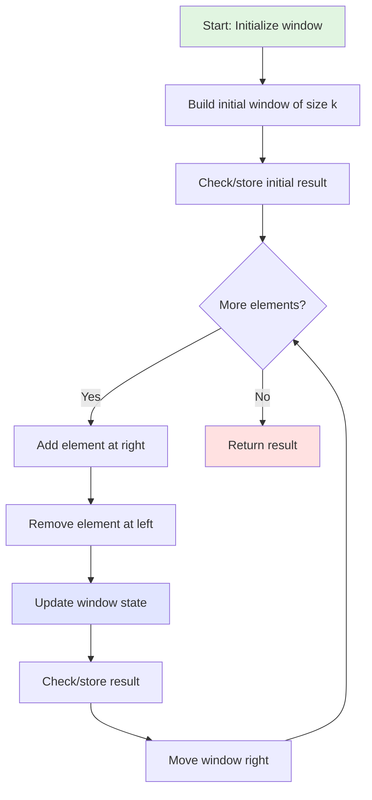
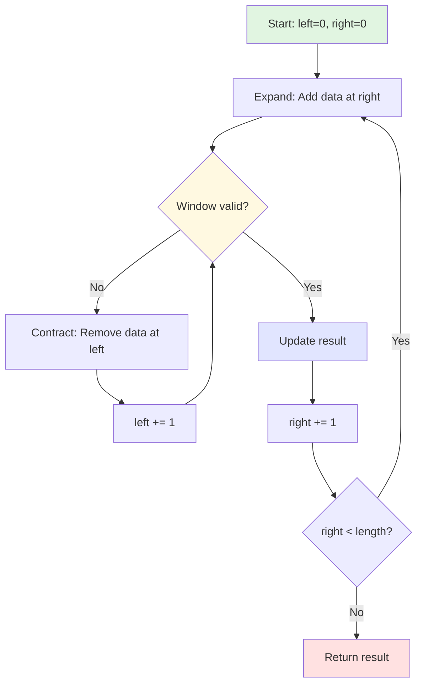
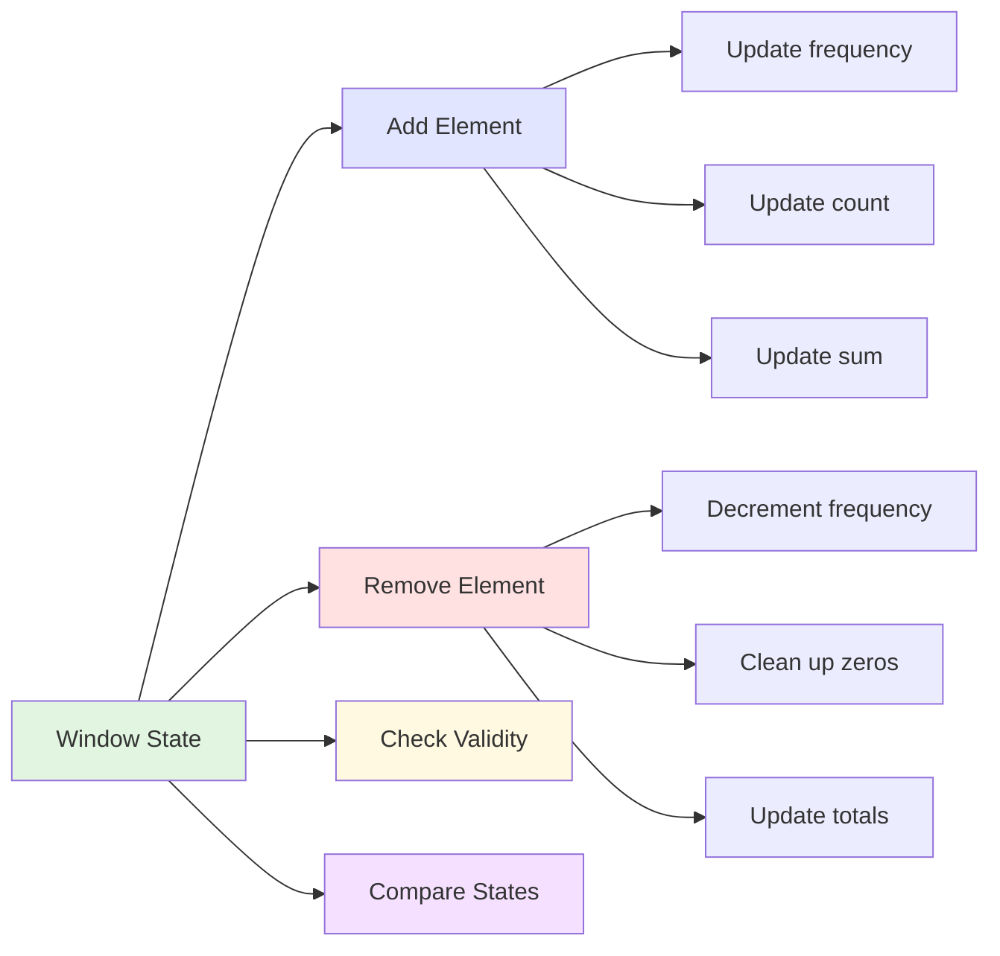
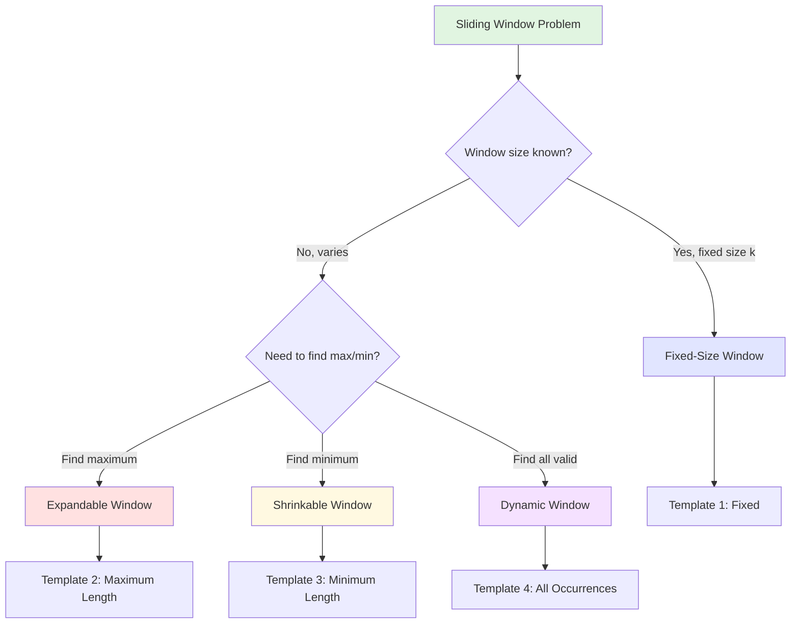
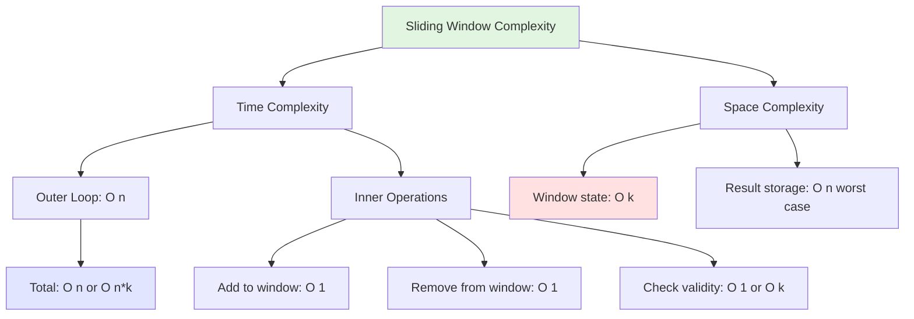
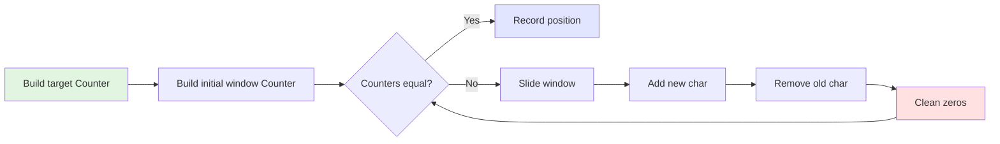
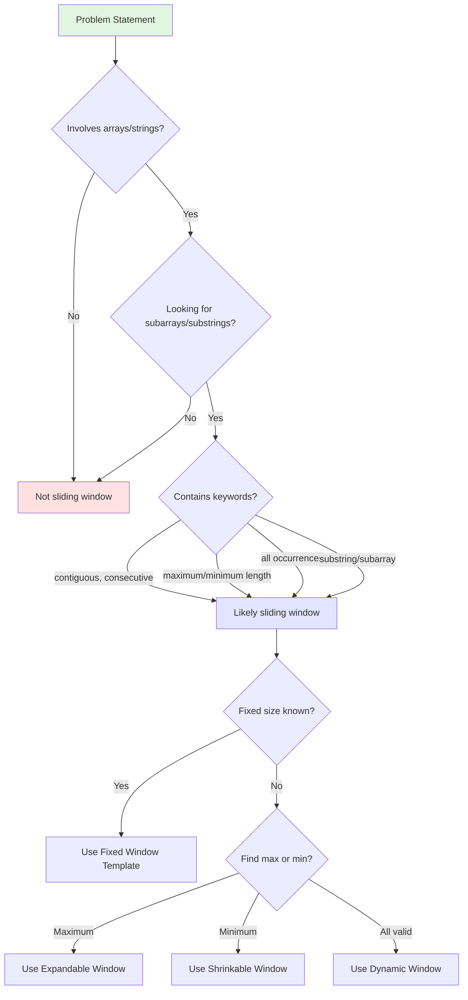
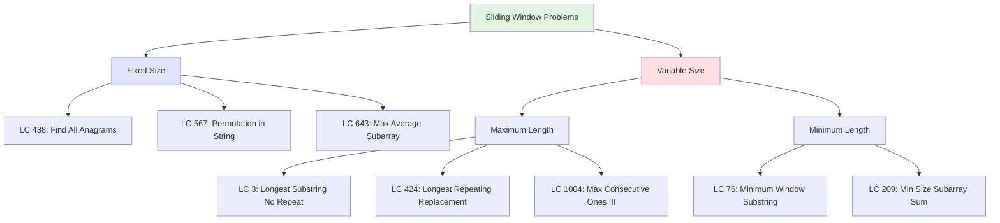
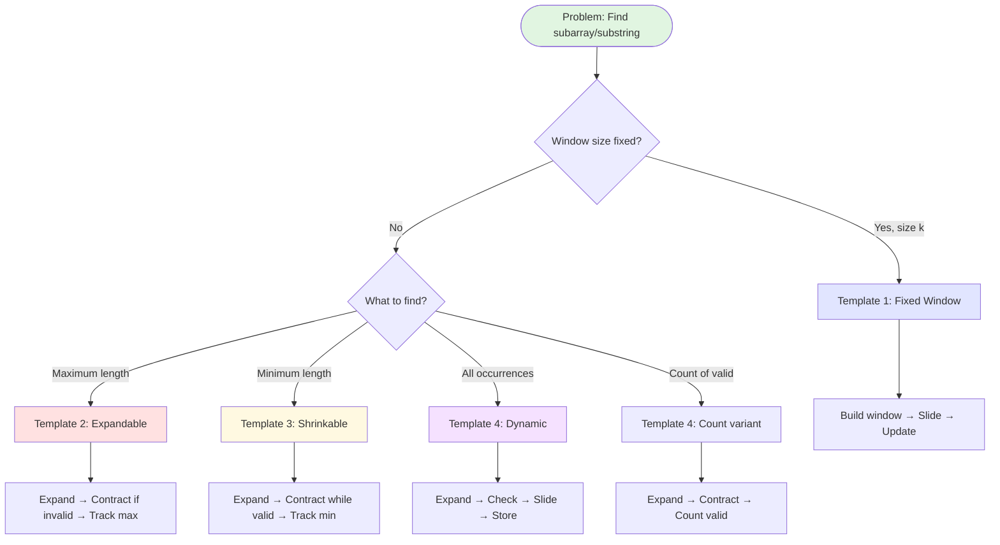

# Sliding Window Technique - Comprehensive Study Guide

## Table of Contents
- [Core Concepts](#core-concepts)
- [Visual Algorithm Flow](#visual-algorithm-flow)
- [Window Types](#window-types)
- [Implementation Strategies](#implementation-strategies)
- [Time & Space Analysis](#time--space-analysis)
- [Common Patterns](#common-patterns)
- [Templates](#templates)
- [Problem Recognition](#problem-recognition)
- [Common Mistakes](#common-mistakes)
- [Related Problems](#related-problems)

---

## Core Concepts

### What is a Sliding Window?

A sliding window is an optimization technique that transforms nested loops into a single loop by maintaining a dynamic subset of elements. Instead of recalculating from scratch for each position, we **incrementally update** by adding new elements and removing old ones.

> **Key Insight:** When you need to check all contiguous subarrays/substrings of a certain size or condition, and there's overlapping work between consecutive checks, use sliding window.

### When to Use Sliding Window

**Problem indicators:**
- Finding subarrays/substrings with specific properties
- Keywords: "contiguous", "consecutive", "subarray", "substring"
- Need to find maximum/minimum length
- Need to find all occurrences matching a pattern
- Checking conditions over a range

**Efficiency gain:**
- Transforms O(n × m) → O(n)
- Avoids redundant recalculation
- Maintains state incrementally

### Core Components

```python
def sliding_window_template():
    left = right = 0
    window_state = {}  # Track window contents
    result = []
    
    while right < len(data):
        # 1. EXPAND: Add new element to window
        add_to_window(data[right])
        
        # 2. CONTRACT: Shrink window if condition violated
        while window_invalid():
            remove_from_window(data[left])
            left += 1
        
        # 3. UPDATE: Record result if valid
        if window_valid():
            update_result()
        
        right += 1
    
    return result
```

### Key Principles

1. **Two Pointers:** `left` and `right` define window boundaries
2. **Window State:** Data structure (dict, set, Counter) tracks window contents
3. **Expand Rightward:** Always move `right` pointer forward
4. **Contract Leftward:** Move `left` pointer when condition violated
5. **Update Result:** Track best/all valid windows seen

---

## Visual Algorithm Flow

### Fixed-Size Window Movement



### Variable-Size Window Movement



### Window State Management



### Decision Tree: Choosing Window Type



---

## Window Types

## Window Types

### Type Comparison

| Type | Window Size | Use Case | Complexity |
|------|-------------|----------|------------|
| **Fixed** | Constant (k) | Check all k-sized subarrays | O(n) |
| **Expandable** | Grows, rarely shrinks | Find maximum length | O(n) |
| **Shrinkable** | Shrinks to minimum | Find minimum length | O(n) |
| **Dynamic** | Both grow and shrink | All valid windows | O(n) |

### 1. Fixed Size Window

**Characteristics:**
- Window size is predetermined (size k)
- Always maintain exactly k elements
- Slide by removing left, adding right

**Visual Example:**
```
Array: [1, 3, 2, 6, -1, 4, 1, 8], k = 3

Window 1: [1, 3, 2] → sum = 6
Window 2:    [3, 2, 6] → sum = 11
Window 3:       [2, 6, -1] → sum = 7
Window 4:          [6, -1, 4] → sum = 9
...
```

**Implementation:**
```python
def fixed_window(arr, k):
    """Find maximum sum of any subarray of size k"""
    if len(arr) < k:
        return None
    
    # Build initial window
    window_sum = sum(arr[:k])
    max_sum = window_sum
    
    # Slide window
    for i in range(k, len(arr)):
        # Remove left element, add right element
        window_sum = window_sum - arr[i-k] + arr[i]
        max_sum = max(max_sum, window_sum)
    
    return max_sum
```

**Common Problems:**
- Maximum sum of subarray size k
- Find all anagrams (LC 438)
- Permutation in string (LC 567)

### 2. Expandable Window (Maximum Length)

**Characteristics:**
- Window grows until condition violated
- Contracts minimally to restore validity
- Tracks maximum valid size seen

**Visual Example:**
```
String: "abcabcbb", find longest substring without repeating

Window: [a] → valid, len=1
Window: [a,b] → valid, len=2
Window: [a,b,c] → valid, len=3
Window: [a,b,c,a] → invalid! Remove 'a'
Window: [b,c,a] → valid, len=3
```

**Implementation:**
```python
def max_length_window(s):
    """Longest substring without repeating characters"""
    left = 0
    window = set()
    max_len = 0
    
    for right in range(len(s)):
        # Contract while duplicate exists
        while s[right] in window:
            window.remove(s[left])
            left += 1
        
        # Expand
        window.add(s[right])
        max_len = max(max_len, right - left + 1)
    
    return max_len
```

**Common Problems:**
- Longest substring without repeating (LC 3)
- Longest repeating character replacement (LC 424)
- Max consecutive ones III (LC 1004)

### 3. Shrinkable Window (Minimum Length)

**Characteristics:**
- Window grows until condition satisfied
- Contracts to find minimum valid size
- Tracks minimum valid size seen

**Visual Example:**
```
Array: [2,3,1,2,4,3], target sum ≥ 7

Window: [2] → sum=2, invalid
Window: [2,3] → sum=5, invalid
Window: [2,3,1] → sum=6, invalid
Window: [2,3,1,2] → sum=8, valid! Try shrink
Window: [3,1,2] → sum=6, invalid, expand again
```

**Implementation:**
```python
def min_length_window(nums, target):
    """Minimum subarray length with sum ≥ target"""
    left = 0
    window_sum = 0
    min_len = float('inf')
    
    for right in range(len(nums)):
        # Expand
        window_sum += nums[right]
        
        # Contract while valid
        while window_sum >= target:
            min_len = min(min_len, right - left + 1)
            window_sum -= nums[left]
            left += 1
    
    return min_len if min_len != float('inf') else 0
```

**Common Problems:**
- Minimum window substring (LC 76)
- Minimum size subarray sum (LC 209)
- Shortest subarray with sum at least K (LC 862)

### 4. Dynamic Window (All Valid Windows)

**Characteristics:**
- Find ALL windows meeting criteria
- Both expand and contract as needed
- Store all valid window positions

**Visual Example:**
```
String s: "cbaebabacd", pattern p: "abc"

Check position 0: "cba" → anagram ✓, store 0
Check position 1: "bae" → not anagram ✗
Check position 2: "aeb" → not anagram ✗
...
Check position 6: "bac" → anagram ✓, store 6
```

**Implementation:**
```python
def all_valid_windows(s, p):
    """Find all anagram positions (LC 438)"""
    from collections import Counter
    
    if len(p) > len(s):
        return []
    
    p_count = Counter(p)
    window = Counter(s[:len(p)])
    result = []
    
    # Check first window
    if p_count == window:
        result.append(0)
    
    # Slide window
    for i in range(len(p), len(s)):
        # Add new character
        window[s[i]] += 1
        
        # Remove old character
        left_char = s[i - len(p)]
        window[left_char] -= 1
        if window[left_char] == 0:
            del window[left_char]
        
        # Check validity
        if p_count == window:
            result.append(i - len(p) + 1)
    
    return result
```

**Common Problems:**
- Find all anagrams (LC 438)
- Substring with concatenation (LC 30)
- Count nice subarrays (LC 1248)

---

## Implementation Strategies
<details>
<summary>Click to expand</summary>

### 1. Hash Map Window
```python
def string_window():
    window = {}  # Character frequency
    needed = {}  # Target frequency
    
    def window_contains_target():
        return all(
            char in window and window[char] >= needed[char]
            for char in needed
        )
```

### 2. Counter Window
```python
from collections import Counter

def counter_window():
    window = Counter()
    target = Counter(target_string)
    
    def is_valid():
        return window & target == target
```

### 3. Numeric Window
```python
def sum_window(nums, target):
    window_sum = 0
    left = 0
    
    for right in range(len(nums)):
        window_sum += nums[right]
        while window_sum > target:
            window_sum -= nums[left]
            left += 1
```
</details>

## Time & Space Analysis

### Complexity Breakdown



### Common Complexities

| Window Type | Time Complexity | Space Complexity | Notes |
|-------------|-----------------|------------------|-------|
| **Fixed Window** | O(n) | O(1) to O(k) | k is window size |
| **Expandable** | O(n) | O(k) | k is max unique elements |
| **Shrinkable** | O(n) | O(k) | k is window contents |
| **Dynamic** | O(n) | O(k) | k is alphabet size |

**Where:**
- `n` = length of input array/string
- `k` = window size, unique elements, or alphabet size (often 26 for lowercase)

### Why Sliding Window is O(n)

**Key Insight:** Each element is added and removed at most once.

```python
# Both pointers only move forward
left = 0
for right in range(len(arr)):  # right moves: n times
    add_element(arr[right])    # Each element added once
    
    while invalid():
        remove_element(arr[left])  # Each element removed at most once
        left += 1
```

**Total operations:**
- Right pointer moves: `n` times
- Left pointer moves: at most `n` times
- Each element: added once, removed once
- **Total: O(n) + O(n) = O(n)**

### Complexity Comparison

#### Brute Force vs Sliding Window

**Problem:** Find all k-sized subarrays with max sum

```python
# BRUTE FORCE
def brute_force(arr, k):
    max_sum = float('-inf')
    for i in range(len(arr) - k + 1):  # O(n)
        window_sum = sum(arr[i:i+k])   # O(k) - recalculate each time
        max_sum = max(max_sum, window_sum)
    return max_sum
# Time: O(n × k), Space: O(1)

# SLIDING WINDOW
def sliding_window(arr, k):
    window_sum = sum(arr[:k])  # O(k) - calculate once
    max_sum = window_sum
    for i in range(k, len(arr)):  # O(n)
        window_sum += arr[i] - arr[i-k]  # O(1) - update incrementally
        max_sum = max(max_sum, window_sum)
    return max_sum
# Time: O(n), Space: O(1)
```

**Performance Gain:**
- Brute Force: O(n × k) = 10,000 operations for n=1000, k=10
- Sliding Window: O(n) = 1,000 operations
- **10x faster!**

### Space Optimization Tips

1. **Use primitives when possible:**
   ```python
   # Instead of Counter for simple sum
   window_sum = 0  # O(1) space
   
   # Instead of list for boolean check
   has_duplicate = False  # O(1) space
   ```

2. **Reuse data structures:**
   ```python
   # Single Counter reused throughout
   window = Counter()
   for i in range(k, len(s)):
       window[s[i]] += 1
       window[s[i-k]] -= 1
       # Same Counter object, O(k) space once
   ```

3. **Clean up unnecessary data:**
   ```python
   # Remove zero counts to keep dict small
   if window[char] == 0:
       del window[char]
   ```

### When Sliding Window Doesn't Help

**Situations where sliding window is NOT O(n):**

1. **Complex validity check:**
   ```python
   # If checking validity takes O(k)
   while not is_valid_window():  # O(k) each check
       left += 1
   # Can become O(n × k) in worst case
   ```

2. **Nested window operations:**
   ```python
   # If you need to sort window contents
   for right in range(len(arr)):
       window.append(arr[right])
       sorted_window = sorted(window)  # O(k log k)
   # Total: O(n × k log k)
   ```

**Solution:** Optimize validity checks or use advanced data structures (heaps, deques).

---

## Templates

### Template 1: Fixed-Size Window

**Use when:** Window size is predetermined (size k)

```python
def fixed_size_window(arr, k):
    """
    Template for fixed-size sliding window problems
    Time: O(n), Space: O(1) or O(k)
    """
    if len(arr) < k:
        return None  # Handle edge case
    
    # Step 1: Build initial window
    window_state = initialize_window(arr[:k])
    result = evaluate_window(window_state)
    
    # Step 2: Slide window
    for i in range(k, len(arr)):
        # Remove leftmost element
        remove_from_window(window_state, arr[i - k])
        
        # Add rightmost element
        add_to_window(window_state, arr[i])
        
        # Evaluate current window
        result = update_result(result, window_state)
    
    return result
```

**Example Application (LC 438 - Find All Anagrams):**
```python
from collections import Counter

def findAnagrams(s: str, p: str) -> List[int]:
    if len(p) > len(s):
        return []
    
    p_count = Counter(p)
    window = Counter(s[:len(p)])
    result = []
    
    if p_count == window:
        result.append(0)
    
    for i in range(len(p), len(s)):
        window[s[i]] += 1
        window[s[i - len(p)]] -= 1
        if window[s[i - len(p)]] == 0:
            del window[s[i - len(p)]]
        
        if p_count == window:
            result.append(i - len(p) + 1)
    
    return result
```

### Template 2: Maximum Length Window

**Use when:** Finding longest valid substring/subarray

```python
def max_length_window(arr):
    """
    Template for finding maximum length window
    Time: O(n), Space: O(k) where k is unique elements
    """
    left = 0
    window_state = initialize_state()
    max_length = 0
    
    for right in range(len(arr)):
        # Expand: Add element at right
        add_to_window(window_state, arr[right])
        
        # Contract: Shrink from left while invalid
        while not is_valid_window(window_state):
            remove_from_window(window_state, arr[left])
            left += 1
        
        # Update maximum length
        max_length = max(max_length, right - left + 1)
    
    return max_length
```

**Example Application (LC 3 - Longest Substring Without Repeating):**
```python
def lengthOfLongestSubstring(s: str) -> int:
    left = 0
    window = set()
    max_len = 0
    
    for right in range(len(s)):
        while s[right] in window:
            window.remove(s[left])
            left += 1
        
        window.add(s[right])
        max_len = max(max_len, right - left + 1)
    
    return max_len
```

### Template 3: Minimum Length Window

**Use when:** Finding shortest valid substring/subarray

```python
def min_length_window(arr, target):
    """
    Template for finding minimum length window
    Time: O(n), Space: O(1) or O(k)
    """
    left = 0
    window_state = initialize_state()
    min_length = float('inf')
    
    for right in range(len(arr)):
        # Expand: Add element at right
        add_to_window(window_state, arr[right])
        
        # Contract: Shrink from left while still valid
        while is_valid_window(window_state, target):
            min_length = min(min_length, right - left + 1)
            remove_from_window(window_state, arr[left])
            left += 1
    
    return min_length if min_length != float('inf') else 0
```

**Example Application (LC 209 - Minimum Size Subarray Sum):**
```python
def minSubArrayLen(target: int, nums: List[int]) -> int:
    left = 0
    window_sum = 0
    min_len = float('inf')
    
    for right in range(len(nums)):
        window_sum += nums[right]
        
        while window_sum >= target:
            min_len = min(min_len, right - left + 1)
            window_sum -= nums[left]
            left += 1
    
    return min_len if min_len != float('inf') else 0
```

### Template 4: Count Valid Windows

**Use when:** Finding all windows that satisfy a condition

```python
def count_valid_windows(arr, condition):
    """
    Template for counting valid windows
    Time: O(n), Space: O(k)
    """
    count = 0
    window_state = initialize_state()
    
    left = 0
    for right in range(len(arr)):
        # Expand: Add element at right
        add_to_window(window_state, arr[right])
        
        # Contract: Shrink until valid
        while not is_valid_window(window_state, condition):
            remove_from_window(window_state, arr[left])
            left += 1
        
        # All windows ending at right are valid
        count += right - left + 1
    
    return count
```

**Example Application (LC 1248 - Count Nice Subarrays):**
```python
def numberOfSubarrays(nums: List[int], k: int) -> int:
    def atMost(k):
        left = 0
        odd_count = 0
        result = 0
        
        for right in range(len(nums)):
            if nums[right] % 2 == 1:
                odd_count += 1
            
            while odd_count > k:
                if nums[left] % 2 == 1:
                    odd_count -= 1
                left += 1
            
            result += right - left + 1
        
        return result
    
    return atMost(k) - atMost(k - 1)
```

---

## Common Patterns

### Pattern 1: Character Frequency Matching

**Problem Type:** Check if substring is anagram/permutation

**Key Components:**
- Use `Counter` or frequency map
- Compare window frequency to target frequency
- Clean up zero-count entries for accurate comparison

**Flow Diagram:**


**Code Pattern:**
```python
from collections import Counter

def frequency_matching(s: str, pattern: str):
    target = Counter(pattern)
    window = Counter(s[:len(pattern)])
    results = []
    
    if target == window:
        results.append(0)
    
    for i in range(len(pattern), len(s)):
        # Add new character
        window[s[i]] += 1
        
        # Remove old character with cleanup
        window[s[i - len(pattern)]] -= 1
        if window[s[i - len(pattern)]] == 0:
            del window[s[i - len(pattern)]]  # Critical for comparison!
        
        if target == window:
            results.append(i - len(pattern) + 1)
    
    return results
```

**Critical Insight:** Always remove zero-count entries when comparing Counters!

### Pattern 2: Unique Elements Constraint

**Problem Type:** Substring with at most/exactly K distinct characters

**Key Components:**
- Use dictionary to track character frequencies
- Track number of unique characters
- Expand/contract based on unique count

**Code Pattern:**
```python
def k_distinct_chars(s: str, k: int) -> int:
    left = 0
    char_count = {}
    max_len = 0
    
    for right in range(len(s)):
        # Expand: Add character
        char_count[s[right]] = char_count.get(s[right], 0) + 1
        
        # Contract: Too many distinct
        while len(char_count) > k:
            char_count[s[left]] -= 1
            if char_count[s[left]] == 0:
                del char_count[s[left]]
            left += 1
        
        max_len = max(max_len, right - left + 1)
    
    return max_len
```

### Pattern 3: Replacement Budget

**Problem Type:** Maximum length with K replacements allowed

**Key Components:**
- Track most frequent element in window
- Calculate replacements needed: `window_size - max_frequency`
- Contract when replacements exceed budget

**Code Pattern:**
```python
def max_length_with_replacements(s: str, k: int) -> int:
    left = 0
    char_count = {}
    max_count = 0  # Most frequent char count
    max_len = 0
    
    for right in range(len(s)):
        # Expand: Add character
        char_count[s[right]] = char_count.get(s[right], 0) + 1
        max_count = max(max_count, char_count[s[right]])
        
        # Check if valid: window_size - max_freq <= k
        window_size = right - left + 1
        if window_size - max_count > k:
            char_count[s[left]] -= 1
            left += 1
        
        max_len = max(max_len, right - left + 1)
    
    return max_len
```

### Pattern 4: Sum/Product Constraint

**Problem Type:** Subarray with sum/product meeting condition

**Key Components:**
- Track running sum or product
- Expand until condition met
- Contract to find optimal

**Code Pattern:**
```python
def subarray_sum_constraint(nums: List[int], target: int) -> int:
    left = 0
    window_sum = 0
    result = 0
    
    for right in range(len(nums)):
        # Expand: Add element
        window_sum += nums[right]
        
        # Contract: Condition met
        while window_sum >= target:
            result = min(result, right - left + 1)
            window_sum -= nums[left]
            left += 1
    
    return result
```

---

## Problem Recognition

### How to Identify Sliding Window Problems



### Problem Recognition Checklist

**Strong Indicators (Use Sliding Window):**
- [ ] Need to examine all contiguous subarrays/substrings
- [ ] Looking for optimal (max/min) length
- [ ] Finding all occurrences matching a pattern
- [ ] Keywords: "consecutive", "contiguous", "substring", "subarray"
- [ ] Brute force would use nested loops with overlapping calculations
- [ ] Window size is fixed OR varies based on a condition

**Weak Indicators (Consider Alternatives):**
- [ ] Need non-contiguous elements (use DP or backtracking)
- [ ] Global optimization without locality (use greedy or DP)
- [ ] Requires sorting first (might be two pointers instead)

### Common Problem Phrases and Their Window Types

| Phrase | Window Type | Example Problem |
|--------|-------------|-----------------|
| "of size k" | Fixed | Max sum subarray of size k |
| "longest substring" | Expandable | Longest substring without repeating |
| "shortest subarray" | Shrinkable | Minimum window substring |
| "all occurrences" | Dynamic | Find all anagrams |
| "at most k" | Expandable with constraint | At most k distinct chars |
| "exactly k" | Two runs of "at most" | Exactly k distinct chars |
| "permutation/anagram" | Fixed (frequency match) | Permutation in string |

---

## Related Problems

### Easy
- **LC 643: Maximum Average Subarray I** - Fixed window, simple sum
- **LC 1876: Substrings of Size Three** - Fixed window, character counting

### Medium
- **LC 3: Longest Substring Without Repeating Characters** - Expandable window with set
- **LC 438: Find All Anagrams in a String** - Fixed window with frequency matching
- **LC 567: Permutation in String** - Fixed window with frequency matching
- **LC 424: Longest Repeating Character Replacement** - Expandable with replacement budget
- **LC 209: Minimum Size Subarray Sum** - Shrinkable window with sum constraint
- **LC 340: Longest Substring with At Most K Distinct** - Expandable with distinct count
- **LC 904: Fruit Into Baskets** - At most 2 distinct (expandable)
- **LC 1004: Max Consecutive Ones III** - Expandable with flip budget
- **LC 1248: Count Nice Subarrays** - Count windows with k odd numbers

### Hard
- **LC 76: Minimum Window Substring** - Shrinkable with multiple character matching
- **LC 239: Sliding Window Maximum** - Fixed window with deque optimization
- **LC 480: Sliding Window Median** - Fixed window with heap/multiset
- **LC 992: Subarrays with K Different Integers** - Exactly k distinct (two "at most")

### Pattern Mapping



---

## Common Mistakes and Solutions

### Mistake 1: Off-by-One in Range

**Problem:** Missing the last valid window position

```python
# WRONG: Misses last window
for i in range(len(s) - k):
    window = s[i:i+k]

# CORRECT: Includes last window
for i in range(len(s) - k + 1):
    window = s[i:i+k]
```

**Why it matters:**
```python
s = "abc", k = 2
# Wrong: range(3-2) = range(1) = [0] → only checks "ab"
# Right: range(3-2+1) = range(2) = [0,1] → checks "ab" and "bc"
```

**Memory Aid:** Last valid start position is `len(s) - k`, and range is exclusive, so add 1.

### Mistake 2: Incorrect Substring Slicing

**Problem:** Wrong indices in substring extraction

```python
# WRONG: Missing index offset
for i in range(len(s)):
    substring = s[i:k]  # Always ends at position k!

# CORRECT: Use i+k for proper window
for i in range(len(s) - k + 1):
    substring = s[i:i+k]  # Window from i to i+k
```

**Example:**
```python
s = "abcd", k = 2, i = 1
# Wrong: s[1:2] = "b" (length 1)
# Right: s[1:1+2] = s[1:3] = "bc" (length 2)
```

### Mistake 3: Not Cleaning Up Zero Counts

**Problem:** Zero-count entries break Counter comparison

```python
# WRONG: Leaves zero counts
window[char] -= 1
# window = {'a': 0, 'b': 1} doesn't match {'b': 1}

# CORRECT: Remove zero entries
window[char] -= 1
if window[char] == 0:
    del window[char]
# window = {'b': 1} matches {'b': 1} ✓
```

**Why it matters:**
```python
Counter({'a': 1, 'b': 1}) == Counter({'a': 0, 'b': 1})  # False!
Counter({'b': 1}) == Counter({'b': 1})  # True
```

### Mistake 4: Window Pointer Management

**Problem:** Moving both pointers when shrinking

```python
# WRONG: Moves window instead of shrinking
if window_invalid():
    left += 1
    right += 1  # Don't move right!

# CORRECT: Only move left to shrink
if window_invalid():
    remove(s[left])
    left += 1
    # right stays put until window is valid
```

**Visualization:**
```
Wrong: [a b c d] → move both → [b c d e] (size unchanged!)
Right: [a b c d] → shrink left → [b c d] (size decreased)
```

### Mistake 5: Index Calculation for Window Start

**Problem:** Recording wrong starting position

```python
# WRONG: Using right pointer as result
for i in range(k, len(s)):
    if is_valid():
        result.append(i)  # i is the right boundary!

# CORRECT: Calculate left boundary
for i in range(k, len(s)):
    if is_valid():
        result.append(i - k + 1)  # Window starts here
```

**Example:**
```python
s = "abcd", k = 2, i = 2 (pointing to 'c')
# Window is "bc" which is s[1:3]
# Wrong: result.append(2) → incorrect start
# Right: result.append(2-2+1) = result.append(1) → correct start
```

### Mistake 6: Uninitialized Window State

**Problem:** Forgetting to build initial window

```python
# WRONG: Starting loop from 0
window = {}
for i in range(len(s)):
    add_to_window(s[i])
    # Window size keeps growing!

# CORRECT: Build initial window first
window = Counter(s[:k])
for i in range(k, len(s)):
    add_to_window(s[i])
    remove_from_window(s[i-k])
    # Window size stays constant
```

### Mistake 7: Wrong Loop Range

**Problem:** Processing elements that shouldn't be in any window

```python
# WRONG: Goes beyond valid windows
for i in range(len(s)):
    window = s[i:i+k]  # Will go out of bounds

# CORRECT: Stop before out of bounds
for i in range(len(s) - k + 1):
    window = s[i:i+k]  # Always valid
```

### Common Pitfalls Checklist

**Before submitting, verify:**
- [ ] Range is `range(len(s) - k + 1)` for fixed windows
- [ ] Substring slicing uses `s[i:i+k]` not `s[i:k]`
- [ ] Zero-count entries are removed from frequency maps
- [ ] Only `left` moves when shrinking window
- [ ] Window start position calculated as `right - k + 1`
- [ ] Initial window built before sliding begins
- [ ] Result updated at correct time (before or after movement)

---

## Quick Reference Guide

### Algorithm Selection Flowchart



### Template Quick Reference

| Template | Use Case | Key Loop | Update Timing |
|----------|----------|----------|---------------|
| **Fixed** | Size k known | `for i in range(k, len(arr))` | After each slide |
| **Expandable** | Find max length | `for right... while invalid: left++` | After contracting |
| **Shrinkable** | Find min length | `for right... while valid: left++` | During contracting |
| **Dynamic** | Find all valid | `for right... slide... check` | When valid |

### Common Operations Cheat Sheet

```python
# Window State Management
window = {}
window[char] = window.get(char, 0) + 1  # Add
window[char] -= 1                        # Remove
if window[char] == 0: del window[char]  # Cleanup

# Using Counter
from collections import Counter
window = Counter(s[:k])                  # Initialize
window[s[i]] += 1                        # Add
window[s[i-k]] -= 1                      # Remove
if window[s[i-k]] == 0: del window[s[i-k]]  # Cleanup

# Window Size Calculation
window_size = right - left + 1

# Window Start Index (for fixed size k)
start_index = right - k + 1

# Valid Range for Fixed Window
for i in range(len(arr) - k + 1):
    window = arr[i:i+k]
```

### Debugging Checklist

When your solution doesn't work:

1. **Print window contents at each step:**
   ```python
   print(f"Window [{left}:{right}]: {arr[left:right+1]}")
   ```

2. **Verify window size:**
   ```python
   print(f"Expected: {k}, Actual: {right - left + 1}")
   ```

3. **Check state consistency:**
   ```python
   print(f"Window state: {window}")
   print(f"Expected state: {target}")
   ```

4. **Validate pointer movements:**
   ```python
   print(f"Left: {left}, Right: {right}")
   ```

5. **Common issues to check:**
   - [ ] Range off by one? (`range(len(s) - k + 1)`)
   - [ ] Slice indices correct? (`s[i:i+k]` not `s[i:k]`)
   - [ ] Zero counts cleaned up? (`if count == 0: del`)
   - [ ] Both pointers moving? (Usually only left should move when contracting)
   - [ ] Result calculated correctly? (`right - k + 1` for start position)

### Performance Benchmarks

| Array Size | Window Size | Brute Force | Sliding Window | Speedup |
|------------|-------------|-------------|----------------|---------|
| 1,000 | 10 | ~10,000 ops | ~1,000 ops | 10x |
| 10,000 | 100 | ~1,000,000 ops | ~10,000 ops | 100x |
| 100,000 | 1,000 | ~100,000,000 ops | ~100,000 ops | 1000x |

---

## Key Takeaways

### The Sliding Window Mindset

> **Core Principle:** Don't recalculate from scratch. Update incrementally.

**Three Questions to Ask:**
1. **What changes?** Only one element enters and one leaves
2. **What stays the same?** Everything else in the window
3. **Can I update in O(1)?** Usually yes with proper data structure

### Pattern Recognition Summary

```python
# If you see these patterns → Think Sliding Window
"find all subarrays of size k"           → Fixed window
"longest substring with..."              → Expandable window
"shortest subarray with..."              → Shrinkable window
"all occurrences of anagram/permutation" → Fixed frequency match
"at most k distinct/unique"              → Expandable with constraint
"exactly k ..."                          → Two "at most" runs
```

### Universal Sliding Window Steps

1. **Initialize:** Set up pointers and window state
2. **Expand:** Add element at right pointer
3. **Check:** Validate window condition
4. **Contract:** Remove elements from left if needed
5. **Update:** Store result if condition met
6. **Advance:** Move right pointer forward
7. **Repeat:** Until right reaches end

### Final Tips

✅ **DO:**
- Start with brute force, then optimize with sliding window
- Use appropriate data structure (Counter, dict, set, primitives)
- Clean up zero counts when using frequency maps
- Test with small examples first
- Verify edge cases (empty, size 1, all same, all different)

❌ **DON'T:**
- Move both pointers when contracting (usually only left moves)
- Forget the `+1` in `range(len(s) - k + 1)`
- Use `s[i:k]` instead of `s[i:i+k]`
- Skip initialization of first window
- Compare Counters with zero-count entries

---

## Additional Resources

### Deep Dive Articles
1. [Sliding Window Algorithm Template](https://leetcode.com/problems/find-all-anagrams-in-a-string/discuss/92007/sliding-window-algorithm-template-to-solve-all-the-leetcode-substring-search-problem) - Comprehensive template discussion
2. [Window Patterns for Strings](https://medium.com/leetcode-patterns/leetcode-pattern-2-sliding-windows-for-strings-e19af105316b) - Pattern recognition guide
3. [Two Pointers vs Sliding Window](https://www.geeksforgeeks.org/window-sliding-technique/) - When to use which

### Practice Problems by Difficulty

**Start Here (Easy):**
- LC 643: Maximum Average Subarray I
- LC 1876: Substrings of Size Three with Distinct Characters

**Build Skills (Medium):**
- LC 3: Longest Substring Without Repeating Characters
- LC 438: Find All Anagrams in a String
- LC 567: Permutation in String
- LC 424: Longest Repeating Character Replacement

**Master Level (Hard):**
- LC 76: Minimum Window Substring
- LC 239: Sliding Window Maximum
- LC 992: Subarrays with K Different Integers

### Visual Learning
- [Visualgo - Sliding Window](https://visualgo.net/en) - Interactive algorithm visualization
- [YouTube - NeetCode Sliding Window Playlist](https://www.youtube.com/c/NeetCode) - Video explanations

---

## Summary

**Sliding Window** transforms O(n²) or O(n × k) problems into O(n) by maintaining a dynamic subset and updating incrementally instead of recalculating from scratch.

**Remember:** The key to mastering sliding window is recognizing when you're doing repetitive work across overlapping subarrays, and knowing which template to apply.

**Success Formula:**
```
Identify Pattern → Choose Template → Initialize State → Expand/Contract → Update Result
```

Happy Sliding! 🎯
